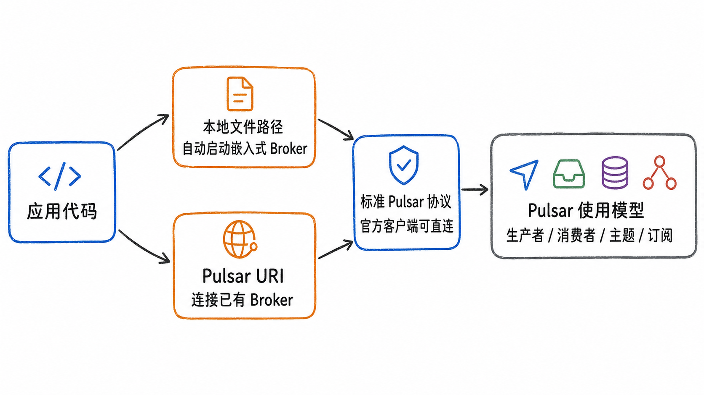
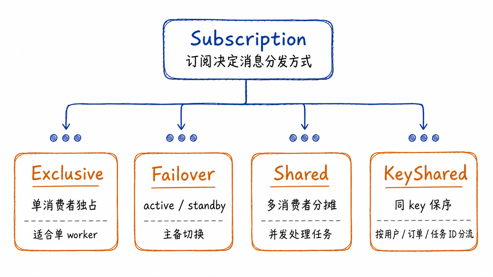
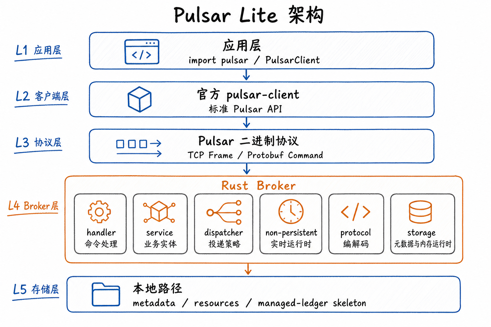

# Pulsar Lite

[](https://github.com/ascentstream/pulsar-lite/actions/workflows/ci.yml)
[](LICENSE)

[English](README.md) | 简体中文

Pulsar Lite 是一个本地轻量级 Apache Pulsar 二进制协议兼容 Broker，主要用于开发、集成测试、Agent 原型和轻量 demo。

> 当前定位：Pulsar Lite 面向本地开发和测试验证，不是生产级 Apache Pulsar 集群替代品。生产环境请使用完整 Apache Pulsar 集群。

## 为什么需要 Pulsar Lite

很多应用只想快速验证一段消息链路：生产者写入、消费者订阅、Shared 分摊、Failover 接管、KeyShared 保序。真正耗时的往往不是 API，而是先准备一套可用的消息队列环境。

Pulsar Lite 的目标是把这段前置成本降下来：

- 单进程本地 Broker 即可运行。
- 官方 Pulsar Python 客户端可以直接连接。
- 本地开发和生产集群使用接近的一套 Pulsar API。
- 支持 `persistent://...` 与 `non-persistent://...` topic 命名。
- 带 `rocksdb-storage` feature 构建时支持 RocksDB-backed persistent storage。



## 当前能力

| 能力 | 状态 | 说明 |
| --- | --- | --- |
| Pulsar 二进制协议 | 已支持核心命令 | Connect、Lookup、PartitionMetadata、Producer、Send、Subscribe、Flow、Ack、Close、Ping/Pong、redelivery 路径 |
| 官方 Python 客户端 | 可直连 | `pulsar.Client("pulsar://localhost:6650")` |
| Pulsar Lite Python SDK | 可用 | `PulsarClient("./demo.db")` 可自动启动本地 Broker |
| Topic 命名 | 兼容 Pulsar URI | 支持 `persistent://...` 与 `non-persistent://...` |
| 分区 Topic | 已支持 | `default_partitions > 0` 时自动使用分区 topic |
| 订阅模式 | 覆盖主要模式 | Shared、Failover、Exclusive、KeyShared |
| Non-persistent 实时语义 | 覆盖较完整 | 动态 consumer、顺序、flow control、断连重连、KeyShared 策略等 |
| Persistent 语义 | RocksDB feature 支持 | 使用 `--features rocksdb-storage` 构建后支持消息与 cursor 跨重启恢复 |

## 快速开始

### 1. 构建 Broker

```bash
cd rust
cargo build --release --features rocksdb-storage
```

生成的 Broker 二进制位于：

```text
rust/target/release/pulsar-lite
```

### 2. 安装 Python SDK

```bash
cd ../python
pip install -e ".[dev]"
```

Python SDK 依赖官方 `pulsar-client>=3.0.0`。

### 3. 嵌入式模式

适合测试、demo、Notebook 和 Agent 原型。传入本地路径后，SDK 会自动启动本地 Broker。

```python
import pulsar
from pulsar_lite import PulsarClient

topic = "non-persistent://public/default/quick-start"

with PulsarClient("./demo.db") as client:
    consumer = client.subscribe(
        topic,
        "quick-start-sub",
        consumer_type=pulsar.ConsumerType.Shared,
    )
    producer = client.create_producer(topic)

    producer.send(b"hello from pulsar lite")

    msg = consumer.receive(timeout_millis=5000)
    print(msg.data().decode("utf-8"))
    consumer.acknowledge(msg)
```

### 4. 官方客户端直连

先启动本地 Broker：

```bash
rust/pulsar-lite.sh start
```

默认监听：

```text
pulsar://localhost:6650
```

然后使用官方 Pulsar 客户端连接：

```python
import pulsar

client = pulsar.Client("pulsar://localhost:6650")
topic = "non-persistent://public/default/events"

consumer = client.subscribe(
    topic,
    "demo-sub",
    consumer_type=pulsar.ConsumerType.Shared,
)
producer = client.create_producer(topic)

producer.send(b"event-1")
msg = consumer.receive(timeout_millis=5000)
consumer.acknowledge(msg)

producer.close()
consumer.close()
client.close()
```

## Topic 和订阅模式

Pulsar Lite 兼容 Pulsar Topic URI：

```text
persistent://public/default/my-topic
non-persistent://public/default/my-topic
```

如果要验证实时事件、任务触发、在线 consumer 分发，优先使用 `non-persistent://...`。如果要验证消息存储、cursor、ack、broker restart 后 replay 或 redelivery 行为，可以使用 `persistent://...`；persistent 路径需要带 `rocksdb-storage` feature 的 broker binary。



| 目标 | 推荐模式 | 说明 |
| --- | --- | --- |
| 单消费者独占处理 | `Exclusive` | 第二个 consumer 会被拒绝 |
| 主备切换 | `Failover` | active 消费，standby 等待接管 |
| 多消费者分摊任务 | `Shared` | 适合并发 worker |
| 同 key 保序 | `KeyShared` | 同 key 消息路由到同一个 consumer |

## 开发命令

```bash
make build        # 构建带 rocksdb-storage 的 Rust Broker
make install      # 安装 Python SDK（开发模式）
make test         # 运行 Rust + Python 测试
make test-rust    # 运行 Rust 测试
make test-python  # 启动本地 broker 并运行 Python 集成测试
make fmt          # 格式化 Rust / Python
make lint         # cargo clippy + ruff
```

## 架构概览



## 主要目录

```text
pulsar-lite/
├── rust/                    # Rust Broker
│   ├── src/broker/          # 连接、服务、dispatcher、runtime
│   ├── src/protocol/        # Pulsar 二进制协议编解码
│   ├── src/storage/         # metadata/resources/managed-ledger/RocksDB
│   └── proto/               # Pulsar protobuf 定义
├── python/                  # Python SDK 与进程管理
├── examples/                # 基础示例
├── tests/                   # Python 集成测试、语义测试、perf 脚本
└── docs/                    # 协议、设计、差异、性能和测试覆盖文档
```

## 与 Apache Pulsar 的关系

| 维度 | Pulsar Lite | Apache Pulsar |
| --- | --- | --- |
| 定位 | 本地开发、测试、demo、Agent 原型 | 生产级云原生消息平台 |
| 部署 | 单进程本地 Broker / 嵌入式启动 | 多组件分布式集群 |
| 客户端 | 官方 Pulsar 客户端 | 官方 Pulsar 客户端 |
| 协议 | 实现核心 Pulsar 二进制协议命令 | 完整协议与生态 |
| 存储 | 本地 RocksDB-backed persistent storage | BookKeeper / Managed Ledger |
| 运维 | 本地进程和文件路径 | 集群容量、高可用、复制、治理 |

## 当前边界

- 不提供生产集群级别的多 Broker 调度、跨节点复制和容量治理。
- 不提供生产级鉴权、多租户治理或 SLA。
- 不保证与 BookKeeper 存储格式兼容。
- 如果业务依赖生产级消息保留、跨节点高可用、多租户治理或 SLA，应直接使用 Apache Pulsar。

## 许可证

Apache License 2.0
