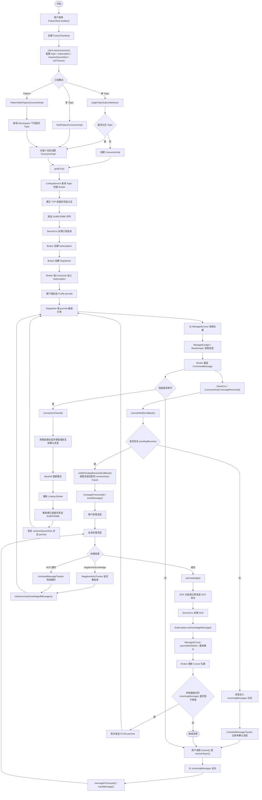

# Pulsar 消息消费完整流程 - 源码级别解析

> 基于 Apache Pulsar 源码，详细解析从客户端订阅消息到确认消息的完整流程。

---

## 目录

1. [整体架构](#1-整体架构)
2. [核心组件职责](#2-核心组件职责)
3. [阶段1：消费者初始化](#3-阶段1消费者初始化)
4. [阶段2：Broker 发现与连接建立](#4-阶段2broker-发现与连接建立)
5. [阶段3：订阅主题](#5-阶段3订阅主题)
6. [阶段4：消息接收 (Client端)](#6-阶段4消息接收-client端)
7. [阶段5：Broker分发消息](#7-阶段5broker分发消息)
8. [阶段6：消息确认](#8-阶段6消息确认)
9. [阶段7：流量控制机制](#9-阶段7流量控制机制)
10. [阶段8：消息重投递机制详解](#10-阶段8消息重投递机制详解)
11. [阶段9：Consumer 重连机制详解](#11-阶段9consumer-重连机制详解)
12. [订阅类型详解](#12-订阅类型详解)
13. [核心概念详解](#13-核心概念详解)
14. [关键源码位置索引](#14-关键源码位置索引)

---

## 1. 整体架构

### 1.1 架构图

```
┌──────────────┐     ┌──────────────┐     ┌──────────────┐     ┌──────────────┐
│   Consumer   │────►│    Broker    │────►│  Subscription│────►│ ManagedLedger│
│   (Client)   │     │  (ServerCnx) │     │  (Dispatcher)│     │  (Cursor)    │
└──────────────┘     └──────────────┘     └──────────────┘     └──────────────┘
       │                    │                    │                    │
       ▼                    ▼                    ▼                    ▼
   用户代码            处理订阅请求          消息分发管理          消息位置追踪
   消息处理            消息推送             消费者管理            读取消息

                                            ┌──────────────┐
                                            │  BookKeeper  │
                                            │  (Bookie)    │
                                            └──────────────┘
                                                    │
                                                    ▼
                                              读取持久化消息
```

### 1.2 数据流转路径

```
消费者订阅: "sub-0"
    │
    │  ① Consumer 初始化 (配置订阅类型、接收队列大小)
    ▼
Lookup 发现 Broker
    │
    │  ② 建立连接 + 认证
    ▼
发送 SUBSCRIBE 命令
    │
    │  ③ Broker 创建 Subscription 和 Dispatcher
    ▼
发送 FLOW 命令 (请求消息)
    │
    │  ④ Broker 从 ManagedLedger 读取消息
    ▼
推送消息到 Consumer (CommandMessage)
    │
    │  ⑤ 客户端接收消息放入队列
    ▼
用户调用 receive() 获取消息
    │
    │  ⑥ 处理消息后发送 ACK
    ▼
Broker 更新 Cursor 位置
```

---

## 2. 核心组件职责

| 组件 | 职责 | 关键操作 |
|------|------|---------|
| **ConsumerImpl** | 消费者客户端实现 | 接收消息、发送确认、流量控制 |
| **ConsumerBase** | 消费者基类 | 提供receive/acknowledge等基础方法 |
| **ClientCnx** | 客户端网络连接 | 处理消息推送、发送命令 |
| **ServerCnx** | Broker连接处理 | 处理SUBSCRIBE/FLOW/ACK命令 |
| **Subscription** | 订阅管理 | 管理消费者、确认消息、维护游标 |
| **Dispatcher** | 消息分发器 | 分发消息给消费者、流量控制 |
| **ManagedCursor** | 消息游标 | 追踪消费位置、读取消息 |
| **Consumer (Broker端)** | Broker端消费者对象 | 维护消息许可、待确认消息 |

---

## 3. 阶段1：消费者初始化

### 3.1 用户代码示例

```java
// ① 创建 PulsarClient
PulsarClient client = PulsarClient.builder()
    .serviceUrl("pulsar://localhost:6650")
    .authentication(AuthenticationFactory.token("xxx"))
    .build();

// ② 创建 Consumer
Consumer<byte[]> consumer = client.newConsumer()
    .topic("persistent://public/default/test")
    .subscriptionName("sub-0")
    .subscriptionType(SubscriptionType.Shared)
    .receiverQueueSize(1000)
    .ackTimeout(30, TimeUnit.SECONDS)
    .subscribe();
```

### 3.2 PulsarClient 构建流程

#### 3.2.1 PulsarClient.builder() 入口

**源码位置**: `PulsarClient.java:54-56`

`PulsarClient.builder()` 是接口中定义的**静态方法**：

```java
// PulsarClient.java (接口)
public interface PulsarClient extends Closeable {

    static ClientBuilder builder() {
        return DefaultImplementation.getDefaultImplementation().newClientBuilder();
    }
}
```

#### 3.2.2 DefaultImplementation - 反射加载实现类

**源码位置**: `pulsar-client-api/src/main/java/org/apache/pulsar/client/internal/DefaultImplementation.java`

```java
// DefaultImplementation.java
public class DefaultImplementation {

    // ★ 静态变量，类加载时初始化
    private static final PulsarClientImplementationBinding IMPLEMENTATION;

    static {
        PulsarClientImplementationBinding impl;
        try {
            // ★★★ 通过反射加载实现类 ★★★
            impl = (PulsarClientImplementationBinding) ReflectionUtils
                    .newClassInstance("org.apache.pulsar.client.impl.PulsarClientImplementationBindingImpl")
                    .getConstructor()
                    .newInstance();
        } catch (Throwable error) {
            throw new RuntimeException("Cannot load Pulsar Client Implementation: " + error, error);
        }
        IMPLEMENTATION = impl;
    }

    // ★ 直接返回静态变量，没有 getInstance() 方法
    public static PulsarClientImplementationBinding getDefaultImplementation() {
        return IMPLEMENTATION;
    }
}
```

#### 3.2.3 反射加载过程详解

**源码位置**: `pulsar-client-api/src/main/java/org/apache/pulsar/client/internal/ReflectionUtils.java`

```java
// ReflectionUtils.java
class ReflectionUtils {

    // ① 根据类名加载 Class 对象
    static <T> Class<T> newClassInstance(String className) {
        try {
            try {
                // 情况1：API 和实现在同一个 ClassLoader 中
                return (Class<T>) Class.forName(
                    className,
                    true,  // initialize = true，立即初始化类（执行 static{} 块）
                    DefaultImplementation.class.getClassLoader()
                );
            } catch (Exception e) {
                // 情况2：API 和实现在不同的 ClassLoader 中
                // 实现的 ClassLoader 需要是 API ClassLoader 的子级
                return (Class<T>) Class.forName(
                    className,
                    true,
                    Thread.currentThread().getContextClassLoader()
                );
            }
        } catch (ClassNotFoundException | NoClassDefFoundError e) {
            throw new RuntimeException(e);
        }
    }
}
```

**反射加载的三个步骤详解**：

```
┌─────────────────────────────────────────────────────────────────────────────┐
│           反射加载 PulsarClientImplementationBindingImpl 详细过程             │
└─────────────────────────────────────────────────────────────────────────────┘

impl = (PulsarClientImplementationBinding) ReflectionUtils
        .newClassInstance("org.apache.pulsar.client.impl.PulsarClientImplementationBindingImpl")
        .getConstructor()
        .newInstance();

═══════════════════════════════════════════════════════════════════════════════

① ReflectionUtils.newClassInstance(className)
━━━━━━━━━━━━━━━━━━━━━━━━━━━━━━━━━━━━━━━━━━━━━━━━━━━━━━━━━━━━━━━━━━━━━━━━━━━━━━━

ReflectionUtils.newClassInstance("org.apache.pulsar.client.impl.PulsarClientImplementationBindingImpl")
    │
    │ ★ 注意：方法名虽为 newClassInstance，但返回的是 Class 对象，不是实例！
    │   这是一个"类加载"方法，命名可能有历史原因
    │
    │ Class.forName(className, true, classLoader)
    │
    ├─► 1. 查找 .class 文件
    │       在 classpath 中查找:
    │       org/apache/pulsar/client/impl/PulsarClientImplementationBindingImpl.class
    │
    ├─► 2. 加载到 JVM
    │       将 .class 文件的二进制数据读入内存方法区
    │
    ├─► 3. 链接（Linking）
    │       ├─► 验证 (Verify): 确保字节码符合 JVM 规范
    │       ├─► 准备 (Prepare): 为静态变量分配内存，设置默认值
    │       └─► 解析 (Resolve): 将符号引用转换为直接引用
    │
    └─► 4. 初始化（Initialization）
            执行类的 static{} 块和静态变量初始化
            (initialize = true 触发此步骤)
    │
    ▼
返回: Class<PulsarClientImplementationBindingImpl> 对象

═══════════════════════════════════════════════════════════════════════════════

② Class.getConstructor()  // ★ Java 反射 API
━━━━━━━━━━━━━━━━━━━━━━━━━━━━━━━━━━━━━━━━━━━━━━━━━━━━━━━━━━━━━━━━━━━━━━━━━━━━━━━

Class<PulsarClientImplementationBindingImpl> 对象
    │
    │ .getConstructor()  // ★ 这是 java.lang.Class.getConstructor()，Java 反射 API
    │
    │ 在类中查找公共无参构造函数:
    │ public PulsarClientImplementationBindingImpl() {
    │     // 无参构造函数
    │ }
    │
    ▼
返回: Constructor<PulsarClientImplementationBindingImpl> 对象

★ 补充说明：ReflectionUtils 类也提供了静态工具方法 getConstructor()：

   // ReflectionUtils.getConstructor(className, argTypes) 源码实现：
   static <T> Constructor<T> getConstructor(String className, Class<?>... argTypes) {
       Class<T> clazz = newClassInstance(className);  // 先加载类
       return clazz.getConstructor(argTypes);          // 再获取构造函数
   }

   // 两种等价的写法：

   // 方式1：链式调用（当前 DefaultImplementation 使用的方式）
   ReflectionUtils.newClassInstance(className).getConstructor().newInstance()

   // 方式2：使用 ReflectionUtils.getConstructor 工具方法
   ReflectionUtils.getConstructor(className).newInstance()

═══════════════════════════════════════════════════════════════════════════════

③ .newInstance()
━━━━━━━━━━━━━━━━━━━━━━━━━━━━━━━━━━━━━━━━━━━━━━━━━━━━━━━━━━━━━━━━━━━━━━━━━━━━━━━

Constructor<PulsarClientImplementationBindingImpl> 对象
    │
    │ .newInstance()  // 参数为空，调用无参构造函数
    │
    │ 底层执行构造函数:
    │ public PulsarClientImplementationBindingImpl() {
    │     // 构造函数体
    │ }
    │
    │ 相当于: new PulsarClientImplementationBindingImpl()
    │
    ▼
返回: PulsarClientImplementationBindingImpl 实例
```

**static{} 块执行完整流程**：

```
┌─────────────────────────────────────────────────────────────────────────────┐
│                    static{} 块执行完整流程                                    │
└─────────────────────────────────────────────────────────────────────────────┘

类加载触发: 当第一次访问 DefaultImplementation 类时
    │
    │ JVM 加载 DefaultImplementation.class
    │
    ▼
执行 static{} 块
    │
    │ ┌─────────────────────────────────────────────────────────────────────┐
    │ │ ① ReflectionUtils.newClassInstance(className)                       │
    │ │    className = "org.apache.pulsar.client.impl.                      │
    │ │                 PulsarClientImplementationBindingImpl"               │
    │ │                                                                     │
    │ │    ★ 注意：方法名虽为 newClassInstance，但返回的是 Class 对象！      │
    │ │    Class.forName(className, true, classLoader)                      │
    │ │    ├─► 加载 .class 文件到 JVM 方法区                                 │
    │ │    ├─► 链接（验证、准备、解析）                                       │
    │ │    └─► 初始化（执行 PulsarClientImplementationBindingImpl 的 static{}）│
    │ │                                                                     │
    │ │    返回: Class<PulsarClientImplementationBindingImpl>               │
    │ └─────────────────────────────────────────────────────────────────────┘
    │                            │
    │                            ▼
    │ ┌─────────────────────────────────────────────────────────────────────┐
    │ │ ② Class.getConstructor()  // ★ Java 反射 API                        │
    │ │                                                                     │
    │ │    在 Class 对象中查找公共无参构造函数:                                │
    │ │    public PulsarClientImplementationBindingImpl() {}                │
    │ │                                                                     │
    │ │    返回: Constructor<PulsarClientImplementationBindingImpl>        │
    │ └─────────────────────────────────────────────────────────────────────┘
    │                            │
    │                            ▼
    │ ┌─────────────────────────────────────────────────────────────────────┐
    │ │ ③ .newInstance()                                                    │
    │ │                                                                     │
    │ │    通过 Constructor 对象调用构造函数:                                 │
    │ │    相当于执行 new PulsarClientImplementationBindingImpl()           │
    │ │                                                                     │
    │ │    返回: PulsarClientImplementationBindingImpl 实例                 │
    │ └─────────────────────────────────────────────────────────────────────┘
    │                            │
    │                            ▼
    │ (PulsarClientImplementationBinding) impl  // 向上转型为接口类型
    │
    ▼
IMPLEMENTATION = impl;  // 赋值给静态常量
    │
    ▼
static{} 块执行完毕
    │
    ▼
DefaultImplementation 类加载完成
```

**为什么要通过反射加载？**

```
┌─────────────────────────────────────────────────────────────────────────────┐
│                          模块依赖关系                                         │
└─────────────────────────────────────────────────────────────────────────────┘

┌──────────────────────────────┐              ┌──────────────────────────────┐
│     pulsar-client-api        │              │       pulsar-client          │
│        (接口模块)              │  ◄── 依赖 ───│        (实现模块)             │
│                              │              │                              │
│  • PulsarClient (接口)        │              │  • PulsarClientImpl          │
│  • ClientBuilder (接口)       │              │  • ClientBuilderImpl         │
│  • DefaultImplementation     │              │  • PulsarClientImplementationBindingImpl │
│  • PulsarClientImplementationBinding (接口) │                              │
└──────────────────────────────┘              └──────────────────────────────┘

问题：
  • api 模块不能直接 import impl 模块的类
  • 否则会产生编译时的循环依赖
  • 用户使用时必须引入所有实现模块

解决方案：
  • api 模块只知道接口
  • 通过反射在运行时动态加载实现类
  • 实现了编译时解耦，运行时绑定
```

#### 3.2.4 PulsarClientImplementationBinding 接口

**源码位置**: `PulsarClientImplementationBinding.java`

```java
// PulsarClientImplementationBinding.java (接口)
public interface PulsarClientImplementationBinding {

    // ★ 创建 ClientBuilder
    ClientBuilder newClientBuilder();

    // 创建 Schema 相关
    <T> SchemaDefinitionBuilder<T> newSchemaDefinitionBuilder();

    // 创建 MessageId
    MessageId newMessageId(long ledgerId, long entryId, int partitionIndex);

    // 创建 Authentication
    Authentication newAuthenticationToken(String token);

    // ... 其他工厂方法
}
```

#### 3.2.5 PulsarClientImplementationBindingImpl 实现

**源码位置**: `PulsarClientImplementationBindingImpl.java`

```java
// PulsarClientImplementationBindingImpl.java
public final class PulsarClientImplementationBindingImpl
        implements PulsarClientImplementationBinding {

    @Override
    public ClientBuilder newClientBuilder() {
        return new ClientBuilderImpl();  // ★ 返回真正的实现
    }

    // ... 其他方法实现
}
```

#### 3.2.6 完整的 PulsarClient.builder() 调用链路

```
┌─────────────────────────────────────────────────────────────────────────────┐
│                    PulsarClient.builder() 完整调用链路                        │
└─────────────────────────────────────────────────────────────────────────────┘

用户代码: PulsarClient.builder()
    │
    │ ① 调用接口静态方法
    ▼
PulsarClient.builder()  [接口静态方法 - PulsarClient.java:54-56]
    │
    │ return DefaultImplementation.getDefaultImplementation().newClientBuilder();
    │
    │ ② 获取静态变量 IMPLEMENTATION
    ▼
DefaultImplementation.getDefaultImplementation()
    │
    │ 直接返回静态变量 IMPLEMENTATION
    │ (类加载时已在 static{} 块中通过反射创建)
    ▼
PulsarClientImplementationBindingImpl 实例
    │
    │ ③ 调用接口方法
    ▼
.newClientBuilder()
    │
    │ ④ return new ClientBuilderImpl();
    ▼
ClientBuilderImpl 实例
    │
    │ ⑤ 链式配置
    ├─► .serviceUrl("pulsar://localhost:6650")
    ├─► .authentication(...)
    └─► .build()
            │
            └─► 创建 PulsarClientImpl
```

#### 3.2.7 ClientBuilderImpl 的作用

**源码位置**: `pulsar-client/src/main/java/org/apache/pulsar/client/impl/ClientBuilderImpl.java`

`ClientBuilderImpl` 是一个**构建器模式（Builder Pattern）**的实现，核心作用是：

1. **存储配置** - 内部持有 `ClientConfigurationData conf` 对象
2. **提供链式配置方法** - 每个方法都返回 `this`
3. **最终创建 PulsarClientImpl 实例**

```java
public class ClientBuilderImpl implements ClientBuilder {

    // ★ 核心配置对象
    ClientConfigurationData conf;

    public ClientBuilderImpl() {
        this.conf = new ClientConfigurationData();  // 初始化默认配置
    }

    // ★ 各种配置方法（链式调用）
    @Override
    public ClientBuilder serviceUrl(String serviceUrl) {
        conf.setServiceUrl(serviceUrl);  // 存入 conf
        return this;  // 返回 this，支持链式调用
    }

    @Override
    public ClientBuilder authentication(Authentication authentication) {
        conf.setAuthentication(authentication);
        return this;
    }

    @Override
    public ClientBuilder connectionTimeout(int duration, TimeUnit unit) {
        conf.setConnectionTimeoutMs((int) unit.toMillis(duration));
        return this;
    }

    // ★★★ 最终构建方法 ★★★
    @Override
    public PulsarClient build() throws PulsarClientException {
        // 1. 校验必填参数
        if (StringUtils.isBlank(conf.getServiceUrl()) && conf.getServiceUrlProvider() == null) {
            throw new IllegalArgumentException("service URL or service URL provider needs to be specified");
        }

        // 2. ★ 创建 PulsarClientImpl (2.10.x 版本)
        PulsarClient client = new PulsarClientImpl(this.conf);

        // 3. 初始化 ServiceUrlProvider
        if (conf.getServiceUrlProvider() != null) {
            conf.getServiceUrlProvider().initialize(client);
        }

        return client;
    }
}
```

**用户代码示例对应的配置存储**：

```
PulsarClient.builder()
    │
    │ new ClientBuilderImpl()
    ▼
ClientBuilderImpl
    │
    │ .serviceUrl("pulsar://localhost:6650")
    │     └─► conf.serviceUrl = "pulsar://localhost:6650"
    │
    │ .connectionTimeout(3000, TimeUnit.MILLISECONDS)
    │     └─► conf.connectionTimeoutMs = 3000
    │
    │ .authentication(AuthenticationFactory.token("xxx"))
    │     └─► conf.authentication = AuthenticationToken
    │
    │ .build()
    │     └─► new PulsarClientImpl(conf)
    ▼
PulsarClientImpl 实例
```

#### 3.2.2 PulsarClientImpl 构造函数详解

**源码位置**: `PulsarClientImpl.java:203-309`

```
┌─────────────────────────────────────────────────────────────────────────────┐
│                     PulsarClientImpl 构造函数初始化                           │
└─────────────────────────────────────────────────────────────────────────────┘

PulsarClientImpl(conf, eventLoopGroup, connectionPool, timer, ...)
    │
    ├─► ① 校验配置
    │       if (conf == null || isBlank(conf.getServiceUrl())) → throw exception
    │
    ├─► ② 创建或使用 EventLoopGroup (Netty IO 线程)
    │       if (eventLoopGroup == null):
    │           eventLoopGroup = PulsarClientResourcesConfigurer.createEventLoopGroup(conf)
    │       // 默认 ioThreads = Runtime.getRuntime().availableProcessors()
    │
    ├─► ③ 启动 Authentication
    │       conf.getAuthentication().start()
    │
    ├─► ④ 创建 ScheduledExecutorProvider
    │       scheduledExecutorProvider = createScheduledExecutorProvider(conf)
    │
    ├─► ⑤ 创建 DNS Resolver + ConnectionPool
    │       dnsResolverGroup = PulsarClientResourcesConfigurer.createDnsResolverGroup(conf)
    │       addressResolver = dnsResolverGroup.createAddressResolver(eventLoopGroup)
    │       connectionPool = ConnectionPool.builder()
    │           .conf(conf)
    │           .eventLoopGroup(eventLoopGroup)
    │           .addressResolverSupplier(addressResolver)
    │           .build()
    │
    ├─► ⑥ 创建各种 ExecutorProvider
    │       externalExecutorProvider = createExternalExecutorProvider(conf)
    │       internalExecutorProvider = createInternalExecutorProvider(conf)
    │       lookupExecutorProvider = createLookupExecutorProvider()
    │
    ├─► ⑦ 创建或使用 Timer (超时/重试定时器)
    │       if (timer == null):
    │           timer = PulsarClientResourcesConfigurer.createTimer()
    │       // HashedWheelTimer，用于超时检测、重试调度
    │
    ├─► ⑧ 创建 LookupService (服务发现)
    │       lookup = createLookup(conf.getServiceUrl())
    │       // 负责根据 Topic 找到对应的 Broker
    │
    ├─► ⑨ 初始化 ServiceUrlProvider
    │       if (conf.getServiceUrlProvider() != null):
    │           conf.getServiceUrlProvider().initialize(this)
    │
    ├─► ⑩ 创建 TransactionCoordinatorClient (如果启用事务)
    │       if (conf.isEnableTransaction()):
    │           tcClient = new TransactionCoordinatorClientImpl(this)
    │           tcClient.start()
    │
    ├─► ⑪ 创建 MemoryLimitController (内存控制)
    │       memoryLimitController = new MemoryLimitController(conf.getMemoryLimitBytes(), ...)
    │       // 限制客户端使用的内存
    │
    └─► ⑫ 设置状态为 Open
            state.set(State.Open)
```

```java
// PulsarClientImpl.java:203-309 (最新版本)
@Builder(builderClassName = "PulsarClientImplBuilder")
PulsarClientImpl(ClientConfigurationData conf,
                 EventLoopGroup eventLoopGroup,
                 ConnectionPool connectionPool,
                 Timer timer,
                 ExecutorProvider externalExecutorProvider,
                 ExecutorProvider internalExecutorProvider,
                 ScheduledExecutorProvider scheduledExecutorProvider,
                 ExecutorProvider lookupExecutorProvider,
                 DnsResolverGroupImpl dnsResolverGroup) throws PulsarClientException {

    EventLoopGroup eventLoopGroupReference = null;
    ConnectionPool connectionPoolReference = null;
    try {
        // 1. 校验配置
        if (conf == null || isBlank(conf.getServiceUrl())) {
            throw new PulsarClientException.InvalidConfigurationException("Invalid client configuration");
        }
        this.conf = conf;

        // 2. 标记哪些资源是本构造函数创建的（需要在 shutdown 时释放）
        this.createdEventLoopGroup = eventLoopGroup == null;
        this.createdCnxPool = connectionPool == null;
        this.createdExecutorProviders = externalExecutorProvider == null;
        this.createdScheduledProviders = scheduledExecutorProvider == null;
        this.createdLookupProviders = lookupExecutorProvider == null;

        // 3. 创建或使用 EventLoopGroup
        eventLoopGroupReference = eventLoopGroup != null ? eventLoopGroup :
                PulsarClientResourcesConfigurer.createEventLoopGroup(conf);
        this.eventLoopGroup = eventLoopGroupReference;

        // 4. 启动 Authentication
        conf.getAuthentication().start();

        // 5. 创建 ScheduledExecutorProvider
        this.scheduledExecutorProvider = scheduledExecutorProvider != null ? scheduledExecutorProvider :
                PulsarClientResourcesConfigurer.createScheduledExecutorProvider(conf);

        // 6. 创建 DNS Resolver 和 ConnectionPool
        if (connectionPool != null) {
            connectionPoolReference = connectionPool;
            addressResolver = dnsResolverGroup != null
                    ? dnsResolverGroup.createAddressResolver(eventLoopGroupReference) : null;
        } else {
            DnsResolverGroupImpl dnsResolverGroupReference = dnsResolverGroup != null ? dnsResolverGroup :
                    PulsarClientResourcesConfigurer.createDnsResolverGroup(conf);
            addressResolver = dnsResolverGroupReference.createAddressResolver(eventLoopGroupReference);
            connectionPoolReference = ConnectionPool.builder()
                    .conf(conf)
                    .eventLoopGroup(eventLoopGroupReference)
                    .addressResolverSupplier(Optional.of(() -> addressResolver))
                    .scheduledExecutorService((ScheduledExecutorService) this.scheduledExecutorProvider.getExecutor())
                    .build();
        }
        this.cnxPool = connectionPoolReference;

        // 7. 创建各种 ExecutorProvider
        this.externalExecutorProvider = externalExecutorProvider != null ? externalExecutorProvider :
                PulsarClientResourcesConfigurer.createExternalExecutorProvider(conf);
        this.internalExecutorProvider = internalExecutorProvider != null ? internalExecutorProvider :
                PulsarClientResourcesConfigurer.createInternalExecutorProvider(conf);
        this.lookupExecutorProvider = lookupExecutorProvider != null ? lookupExecutorProvider :
                PulsarClientResourcesConfigurer.createLookupExecutorProvider();

        // 8. 创建或使用 Timer
        if (timer == null) {
            this.timer = PulsarClientResourcesConfigurer.createTimer();
            needStopTimer = true;
        } else {
            this.timer = timer;
        }

        // 9. 创建 LookupService
        lookup = createLookup(conf.getServiceUrl());

        // 10. 初始化 ServiceUrlProvider
        if (conf.getServiceUrlProvider() != null) {
            conf.getServiceUrlProvider().initialize(this);
        }

        // 11. 创建 TransactionCoordinatorClient (如果启用事务)
        if (conf.isEnableTransaction()) {
            tcClient = new TransactionCoordinatorClientImpl(this);
            tcClient.start();
        }

        // 12. 创建 MemoryLimitController
        memoryLimitController = new MemoryLimitController(conf.getMemoryLimitBytes(), ...);

        // 13. 设置状态为 Open
        state.set(State.Open);
    } catch (Throwable t) {
        // 异常处理：释放已创建的资源
        shutdown();
        shutdownEventLoopGroup(eventLoopGroupReference);
        closeCnxPool(connectionPoolReference);
        throw t;
    }
}
```

#### 3.2.3 PulsarClientImpl 接口与实现关系

```
┌─────────────────────────────────────────────────────────────────────────────┐
│                     PulsarClient 接口层级                                     │
└─────────────────────────────────────────────────────────────────────────────┘

PulsarClient (接口)
     │
     │ static builder()
     ▼
ClientBuilder (接口)
     │
     │ implements
     ▼
ClientBuilderImpl
     │
     │ build()
     ▼
PulsarClientImpl

关键方法:
┌─────────────────────────────────────────────────────────────────────────────┐
│  PulsarClient 接口                                                          │
│  ├── newConsumer()      → 创建消费者                                         │
│  ├── newProducer()      → 创建生产者                                         │
│  ├── newReader()        → 创建读取器                                         │
│  ├── close()            → 关闭客户端                                         │
│  └── shutdown()         → 关闭并释放资源                                     │
└─────────────────────────────────────────────────────────────────────────────┘
```

### 3.3 Consumer 创建流程

#### 3.3.1 newConsumer() 的实现位置

**重要**：`newConsumer()` 是 `PulsarClient` **接口中定义的实例方法**，在 `PulsarClientImpl` 中**直接实现**。

| 方法 | 类型 | 定义位置 | 实现位置 | 是否经过 Binding |
|------|------|---------|---------|-----------------|
| `builder()` | 静态方法 | PulsarClient 接口 | DefaultImplementation | ✅ 是 |
| `newConsumer()` | 实例方法 | PulsarClient 接口 | PulsarClientImpl | ❌ 否 |

**源码位置**: `pulsar-client/src/main/java/org/apache/pulsar/client/impl/PulsarClientImpl.java:347-354`

```java
// PulsarClientImpl.java
public class PulsarClientImpl implements PulsarClient {

    // ★ newConsumer() 在这里直接实现
    @Override
    public ConsumerBuilder<byte[]> newConsumer() {
        return new ConsumerBuilderImpl<>(this, Schema.BYTES);
    }

    @Override
    public <T> ConsumerBuilder<T> newConsumer(Schema<T> schema) {
        return new ConsumerBuilderImpl<>(this, schema);
    }
}
```

#### 3.3.2 ConsumerBuilder 构建流程

**源码位置**: `pulsar-client/src/main/java/org/apache/pulsar/client/impl/ConsumerBuilderImpl.java`

```
┌─────────────────────────────────────────────────────────────────────────────┐
│                        ConsumerBuilder 构建流程                               │
└─────────────────────────────────────────────────────────────────────────────┘

pulsarClientImpl.newConsumer()  [实例方法 - PulsarClientImpl]
    │
    │ 直接 new，不经过 PulsarClientImplementationBindingImpl
    ▼
new ConsumerBuilderImpl<>(this, Schema.BYTES)
    │
    │ 链式配置
    ├─► .topic("persistent://public/default/test")
    ├─► .subscriptionName("sub-0")
    ├─► .subscriptionType(SubscriptionType.Shared)
    ├─► .receiverQueueSize(1000)
    └─► .subscribe()
            │
            └─► PulsarClientImpl.subscribeAsync()
                    │
                    └─► new ConsumerImpl(...)
```

```java
// ConsumerBuilderImpl.java:85-123
@Override
public Consumer<T> subscribe() throws PulsarClientException {
    // 1. 校验配置
    validate();

    // 2. 同步等待异步结果
    try {
        return subscribeAsync().get();
    } catch (Exception e) {
        throw PulsarClientException.unwrap(e);
    }
}

@Override
public CompletableFuture<Consumer<T>> subscribeAsync() {
    // 1. 校验 Topic 和 Subscription
    validate();

    // 2. 检查 Schema
    if (schema != null) {
        conf.setSchema(schema);
    }

    // 3. ★ 委托给 PulsarClientImpl
    return client.subscribeAsync(conf, schema, interceptorList);
}

private void validate() {
    // Topic 名称校验
    if (conf.getTopicNames().isEmpty()) {
        throw new IllegalArgumentException("Topic is required");
    }

    // Subscription 名称校验
    if (StringUtils.isBlank(conf.getSubscriptionName())) {
        throw new IllegalArgumentException("Subscription name is required");
    }

    // 订阅类型和 ACK 类型校验
    if (conf.getAckTimeoutMillis() > 0 &&
        conf.getSubscriptionType() != SubscriptionType.Exclusive &&
        conf.getSubscriptionType() != SubscriptionType.Failover) {
        // ACK 超时只建议用于 Exclusive/Failover 订阅
        log.warn("ackTimeout is not recommended for Shared subscription");
    }
}
```

#### 3.3.2 PulsarClientImpl.subscribeAsync() 实现

**源码位置**: `PulsarClientImpl.java:560-608`

```java
public <T> CompletableFuture<Consumer<T>> subscribeAsync(
        ConsumerConfigurationData<T> conf,
        Schema<T> schema,
        ConsumerInterceptors<T> interceptors) {

    // 1. 校验客户端状态
    if (state.get() != State.Open) {
        return FutureUtil.failedFuture(
            new PulsarClientException.AlreadyClosedException("Client already closed"));
    }

    // 2. 校验配置对象
    if (conf == null) {
        return FutureUtil.failedFuture(
            new PulsarClientException.InvalidConfigurationException("Consumer configuration undefined"));
    }

    // 3. 校验所有 Topic 名称有效性
    for (String topic : conf.getTopicNames()) {
        if (!TopicName.isValid(topic)) {
            return FutureUtil.failedFuture(
                new PulsarClientException.InvalidTopicNameException("Invalid topic name: '" + topic + "'"));
        }
    }

    // 4. 校验订阅名称
    if (isBlank(conf.getSubscriptionName())) {
        return FutureUtil.failedFuture(
            new PulsarClientException.InvalidConfigurationException("Empty subscription name"));
    }

    // 5. 校验 readCompacted 配置
    // 只能用于 persistent topic + Exclusive/Failover 订阅模式
    if (conf.isReadCompacted() && (!conf.getTopicNames().stream()
            .allMatch(topic -> TopicName.get(topic).getDomain() == TopicDomain.persistent)
            || (conf.getSubscriptionType() != SubscriptionType.Exclusive
                && conf.getSubscriptionType() != SubscriptionType.Failover))) {
        return FutureUtil.failedFuture(
            new PulsarClientException.InvalidConfigurationException(
                "Read compacted can only be used with exclusive or failover persistent subscriptions"));
    }

    // 6. 校验 ConsumerEventListener 配置
    // Active consumer listener 只支持 Failover 订阅模式
    if (conf.getConsumerEventListener() != null
            && conf.getSubscriptionType() != SubscriptionType.Failover) {
        return FutureUtil.failedFuture(
            new PulsarClientException.InvalidConfigurationException(
                "Active consumer listener is only supported for failover subscription"));
    }

    // 7. 根据订阅模式选择不同的处理路径
    if (conf.getTopicsPattern() != null) {
        // 正则匹配 Topic 模式
        if (!conf.getTopicNames().isEmpty()) {
            return FutureUtil.failedFuture(
                new IllegalArgumentException("Topic names list must be null when use topicsPattern"));
        }
        return patternTopicSubscribeAsync(conf, schema, interceptors);

    } else if (conf.getTopicNames().size() == 1) {
        // 单 Topic 订阅
        return singleTopicSubscribeAsync(conf, schema, interceptors);

    } else {
        // 多 Topic 订阅
        return multiTopicSubscribeAsync(conf, schema, interceptors);
    }
}
```

#### 3.3.3 三种订阅模式详解

```
┌─────────────────────────────────────────────────────────────────────────────┐
│                    subscribeAsync() 分流决策                                  │
└─────────────────────────────────────────────────────────────────────────────┘

PulsarClientImpl.subscribeAsync(conf, schema, interceptors)
    │
    ├─► 校验客户端状态、配置对象、Topic名称、订阅名称等
    │
    └─► 根据订阅模式选择处理路径
            │
            ├─► topicsPattern != null
            │       └─► patternTopicSubscribeAsync()    【正则匹配多Topic】
            │
            ├─► topicNames.size() == 1
            │       └─► singleTopicSubscribeAsync()     【单Topic订阅】
            │
            └─► topicNames.size() > 1
                    └─► multiTopicSubscribeAsync()      【多Topic订阅】
```

---

##### 3.3.3.1 singleTopicSubscribeAsync - 单 Topic 订阅

**源码位置**: `PulsarClientImpl.java:610-660`

```java
private <T> CompletableFuture<Consumer<T>> singleTopicSubscribeAsync(
        ConsumerConfigurationData<T> conf,
        Schema<T> schema,
        ConsumerInterceptors<T> interceptors) {

    String topic = conf.getSingleTopic();
    CompletableFuture<Consumer<T>> consumerSubscribedFuture = new CompletableFuture<>();

    // ① 预处理 Schema（如果需要）
    preProcessSchemaBeforeSubscribe(this, schema, topic)
        .thenAccept(schemaClone -> {
            // ② 获取 Topic 分区元数据
            getPartitionedTopicMetadata(topic)
                .thenAccept(metadata -> {
                    if (metadata.partitions > 0) {
                        // ③ 分区 Topic：创建 MultiTopicsConsumerImpl（内含多个 ConsumerImpl）
                        ConsumerBase<T> consumer = MultiTopicsConsumerImpl
                            .createPartitionedConsumer(
                                PulsarClientImpl.this,
                                conf,
                                externalExecutorProvider,
                                consumerSubscribedFuture,
                                metadata.partitions,
                                schemaClone, interceptors);
                        consumers.add(consumer);
                    } else {
                        // ④ 非分区 Topic：直接创建 ConsumerImpl
                        doSubscribeAsync(consumerSubscribedFuture, conf, schemaClone, interceptors);
                    }
                })
                .exceptionally(ex -> {
                    consumerSubscribedFuture.completeExceptionally(ex);
                    return null;
                });
        });

    return consumerSubscribedFuture;
}
```

```
┌─────────────────────────────────────────────────────────────────────────────┐
│              singleTopicSubscribeAsync() 完整流程                             │
└─────────────────────────────────────────────────────────────────────────────┘

singleTopicSubscribeAsync(conf, schema, interceptors)
    │
    │  topic = conf.getSingleTopic()  // 获取单个 Topic 名称
    │
    ▼
preProcessSchemaBeforeSubscribe(this, schema, topic)
    │
    │  Schema 预处理（检查、克隆等）
    │
    ▼
getPartitionedTopicMetadata(topic)
    │
    │  向 Broker 查询该 Topic 的分区数
    │
    ▼
metadata.partitions > 0 ?
    │
    ├─► YES（分区 Topic）
    │       │
    │       │  例如: topic "my-topic" 有 3 个分区
    │       │  实际订阅: my-topic-partition-0, my-topic-partition-1, my-topic-partition-2
    │       │
    │       ▼
    │   MultiTopicsConsumerImpl.createPartitionedConsumer(partitions=3)
    │       │
    │       │  内部会为每个分区创建一个 ConsumerImpl
    │       │  consumers["my-topic-partition-0"] = ConsumerImpl_0
    │       │  consumers["my-topic-partition-1"] = ConsumerImpl_1
    │       │  consumers["my-topic-partition-2"] = ConsumerImpl_2
    │       │
    │       ▼
    │   每个 ConsumerImpl.grabCnx() → 建立 TCP 连接
    │
    └─► NO（非分区 Topic）
            │
            │  直接订阅单个 Topic
            │
            ▼
        doSubscribeAsync(...)
            │
            │  创建单个 ConsumerImpl
            │
            ▼
        new ConsumerImpl(client, topic, ...)
            │
            └─► grabCnx() → 建立 TCP 连接
```

**关键点**：
- 单 Topic 也可能是**分区 Topic**，这种情况下会创建 `MultiTopicsConsumerImpl` 来管理多个分区消费者
- 只有非分区 Topic 才直接创建 `ConsumerImpl`

---

##### 3.3.3.2 multiTopicSubscribeAsync - 多 Topic 订阅

**源码位置**: `PulsarClientImpl.java:618-660`

```java
private <T> CompletableFuture<Consumer<T>> multiTopicSubscribeAsync(
        ConsumerConfigurationData<T> conf,
        Schema<T> schema,
        ConsumerInterceptors<T> interceptors) {

    CompletableFuture<Consumer<T>> consumerSubscribedFuture = new CompletableFuture<>();

    // ① 直接创建 MultiTopicsConsumerImpl
    MultiTopicsConsumerImpl<T> consumer = new MultiTopicsConsumerImpl<>(
            PulsarClientImpl.this,
            conf,
            externalExecutorProvider,
            consumerSubscribedFuture,
            schema,
            interceptors,
            true /* createTopicIfDoesNotExist */);

    // ② 添加到消费者列表
    consumers.add(consumer);

    return consumerSubscribedFuture;
}
```

```
┌─────────────────────────────────────────────────────────────────────────────┐
│              multiTopicSubscribeAsync() 完整流程                              │
└─────────────────────────────────────────────────────────────────────────────┘

multiTopicSubscribeAsync(conf, schema, interceptors)
    │
    │  conf.getTopicNames() = ["topic-A", "topic-B", "topic-C"]
    │
    ▼
new MultiTopicsConsumerImpl<>(client, conf, ...)
    │
    │  ★ 调用父类构造函数（Java 继承机制）
    │
    ▼
MultiTopicsConsumerImpl 构造函数
    │
    │  初始化:
    │  - consumers = new ConcurrentHashMap<>()      // 存储子消费者
    │  - partitionedTopics = new ConcurrentHashMap<>()
    │  - allTopicPartitionsNumber = new AtomicInteger(0)
    │
    │  检查: conf.getTopicNames().isEmpty()?
    │  - 如果为空 → 直接完成，返回 Ready 状态
    │  - 如果不为空 → 继续订阅流程
    │
    ▼
遍历 conf.getTopicNames()，对每个 topic 调用 subscribeAsync()
    │
    │  for (topic in ["topic-A", "topic-B", "topic-C"]):
    │      subscribeAsync(topic, createTopicIfDoesNotExist)
    │
    ▼
subscribeAsync(topicName, createTopicIfDoesNotExist)
    │
    │  获取 Topic 分区元数据
    │
    ▼
getPartitionedTopicMetadata(topicName)
    │
    ├─► 分区 Topic（如 topic-A 有 2 个分区）
    │       │
    │       ▼
    │   subscribeTopicPartitions(fullTopicName, partitions)
    │       │
    │       │  为每个分区创建 ConsumerImpl:
    │       │  - ConsumerImpl_A_0 → grabCnx() → Lookup → 连接 Broker
    │       │  - ConsumerImpl_A_1 → grabCnx() → Lookup → 连接 Broker
    │
    └─► 非分区 Topic
            │
            ▼
        createInternalConsumer(topicName, ...)
            │
            │  ConsumerImpl.newConsumerImpl(...)
            │
            └─► grabCnx() → Lookup → 连接 Broker

┌─────────────────────────────────────────────────────────────────────────────┐
│                      最终内存结构                                              │
└─────────────────────────────────────────────────────────────────────────────┘

MultiTopicsConsumerImpl
    │
    ├── consumers (ConcurrentHashMap<String, ConsumerImpl>)
    │       │
    │       ├── "persistent://public/default/topic-A-partition-0" → ConsumerImpl_0
    │       ├── "persistent://public/default/topic-A-partition-1" → ConsumerImpl_1
    │       ├── "persistent://public/default/topic-B" → ConsumerImpl_2
    │       └── "persistent://public/default/topic-C" → ConsumerImpl_3
    │
    └── partitionedTopics (ConcurrentHashMap<String, Integer>)
            │
            └── "persistent://public/default/topic-A" → 2 (分区数)
```

**关键点**：
- `MultiTopicsConsumerImpl` 内部维护一个 `consumers` Map，存储所有子 Consumer
- 每个 Topic 都会独立进行 Lookup，找到对应的 Broker 建立连接
- 用户调用 `receive()` 时，`MultiTopicsConsumerImpl` 会从所有子 Consumer 的消息队列中获取消息

---

##### 3.3.3.3 patternTopicSubscribeAsync - 正则匹配订阅

**源码位置**: `PulsarClientImpl.java:667-722`

```java
private <T> CompletableFuture<Consumer<T>> patternTopicSubscribeAsync(
        ConsumerConfigurationData<T> conf,
        Schema<T> schema,
        ConsumerInterceptors<T> interceptors) {

    // ① 解析正则表达式，提取 Namespace
    String regex = conf.getTopicsPattern().pattern();  // "persistent://public/default/log-.*"
    Mode subscriptionMode = convertRegexSubscriptionMode(conf.getRegexSubscriptionMode());
    TopicName destination = TopicName.get(regex);
    NamespaceName namespaceName = destination.getNamespaceObject();  // "public/default"
    TopicsPattern pattern = TopicsPatternFactory.create(conf.getTopicsPattern());

    CompletableFuture<Consumer<T>> consumerSubscribedFuture = new CompletableFuture<>();

    // ② ★ 向 Broker 查询该 Namespace 下所有匹配的 Topic
    lookup.getTopicsUnderNamespace(namespaceName, subscriptionMode, regex, null, conf.getProperties())
        .thenAccept(getTopicsResult -> {
            // ③ 过滤出匹配正则的 Topic
            List<String> topicsList;
            if (!getTopicsResult.isFiltered()) {
                topicsList = TopicList.filterTopics(getTopicsResult.getTopics(), pattern);
            } else {
                topicsList = getTopicsResult.getTopics().stream()
                        .map(TopicName::get).map(TopicName::toString)
                        .collect(Collectors.toList());
            }

            // ④ 将匹配的 Topic 加入配置
            conf.getTopicNames().addAll(topicsList);
            conf.setAutoUpdatePartitions(false);  // Pattern Consumer 有自己的更新机制

            // ⑤ ★ 创建 PatternMultiTopicsConsumerImpl
            ConsumerBase<T> consumer = new PatternMultiTopicsConsumerImpl<>(
                    pattern,
                    PulsarClientImpl.this,
                    conf,
                    externalExecutorProvider,
                    consumerSubscribedFuture,
                    schema, subscriptionMode, interceptors);

            consumers.add(consumer);
        })
        .exceptionally(ex -> {
            log.warn("[{}] Failed to get topics under namespace", namespaceName);
            consumerSubscribedFuture.completeExceptionally(ex);
            return null;
        });

    return consumerSubscribedFuture;
}
```

```
┌─────────────────────────────────────────────────────────────────────────────┐
│              patternTopicSubscribeAsync() 完整流程                            │
└─────────────────────────────────────────────────────────────────────────────┘

patternTopicSubscribeAsync(conf, schema, interceptors)
    │
    │  conf.getTopicsPattern() = "persistent://public/default/log-.*"
    │
    ▼
① 解析正则表达式，提取 Namespace
    │
    │  regex = "persistent://public/default/log-.*"
    │  namespaceName = "public/default"
    │  pattern = TopicsPattern
    │
    ▼
② lookup.getTopicsUnderNamespace(namespaceName, subscriptionMode, regex, ...)
    │
    │  ★★★ 关键：获取 Topic 列表 ★★★
    │
    │  BinaryProtoLookupService.getTopicsUnderNamespace()
    │      │
    │      │  client.getCnxPool().getConnection(serviceNameResolver)
    │      │      └── 使用 serviceUrl（如 "pulsar://localhost:6650"）建立连接
    │      │
    │      │  clientCnx.newGetTopicsOfNamespaceRequest(...)
    │      │      └── 发送命令到 Broker
    │      │
    │      │  Broker 从 ZooKeeper 查询该 Namespace 下所有 Topic
    │      │      └── 返回: ["log-2024-01", "log-2024-02", "log-2024-03", ...]
    │      │
    │      ▼
    │  getTopicsResult = {
    │      topics: ["log-2024-01", "log-2024-02", "log-2024-03"],
    │      topicsHash: "abc123",
    │      isFiltered: true
    │  }
    │
    ▼
③ 过滤出匹配正则的 Topic
    │
    │  topicsList = TopicList.filterTopics(getTopicsResult.getTopics(), pattern)
    │
    ▼
④ 将匹配的 Topic 加入配置
    │
    │  conf.getTopicNames().addAll(topicsList)
    │  conf.getTopicNames() = ["log-2024-01", "log-2024-02", "log-2024-03"]
    │
    ▼
⑤ new PatternMultiTopicsConsumerImpl<>(pattern, ...)
    │
    │  ★ 继承 MultiTopicsConsumerImpl
    │
    ▼
PatternMultiTopicsConsumerImpl 构造函数
    │
    │  super(client, conf, ...)  ← 调用父类 MultiTopicsConsumerImpl 构造函数
    │
    ▼
MultiTopicsConsumerImpl 构造函数
    │
    │  遍历 conf.getTopicNames() 中的每个 Topic:
    │  for (topic in ["log-2024-01", "log-2024-02", "log-2024-03"]):
    │      subscribeAsync(topic, ...)
    │
    ▼
对每个 Topic 进行 Lookup 并建立连接
    │
    │  subscribeAsync("log-2024-01")
    │      └── createInternalConsumer() → ConsumerImpl → grabCnx()
    │              └── lookup.getBroker(topic) → 找到该 Topic 所属的 Broker
    │              └── getConnection(brokerAddress) → 建立 TCP 连接
    │
    │  subscribeAsync("log-2024-02")
    │      └── createInternalConsumer() → ConsumerImpl → grabCnx()
    │              └── lookup.getBroker(topic) → 可能是不同的 Broker
    │              └── getConnection(brokerAddress) → 建立 TCP 连接
    │
    │  ...每个 Topic 独立 Lookup，连接到各自所属的 Broker
    │
    ▼
⑥ PatternMultiTopicsConsumerImpl 额外功能
    │
    │  - TopicListWatcher: 监听 Topic 列表变化
    │  - 定时 recheckTopicsChange(): 周期性检查是否有新 Topic 匹配
    │  - 动态添加/移除 Consumer
    │
    ▼
完成！
```

**关键点**：

| 阶段 | 使用的连接 | 目的 |
|------|-----------|------|
| 获取 Topic 列表 | serviceUrl（任意 Broker） | 查询 Namespace 下匹配的 Topic |
| Consumer 建立长连接 | **Lookup 返回的特定 Broker** | 订阅、接收消息 |

```
┌─────────────────────────────────────────────────────────────────────────────┐
│                 获取 Topic 列表 vs 建立长连接的区别                            │
└─────────────────────────────────────────────────────────────────────────────┘

1. 获取 Topic 列表（getTopicsUnderNamespace）
   ┌──────────┐                    ┌──────────┐
   │ Consumer │ ─────查询────────► │ 任意     │
   │  Client  │    Topic列表       │ Broker   │
   └──────────┘                    └────┬─────┘
                                        │
                                        │ Broker 从 ZooKeeper 查询
                                        │ （任意 Broker 都能查）
                                        ▼
                                   ┌──────────┐
                                   │ZooKeeper │
                                   └──────────┘

2. Consumer 建立长连接（每个 Topic 独立 Lookup）
   ┌──────────┐                    ┌──────────┐
   │ Consumer │ ──Lookup log-01──► │ Broker A │  (log-01 所属)
   │  Client  │                    └──────────┘
   │          │ ──Lookup log-02──► ┌──────────┐
   │          │                    │ Broker B │  (log-02 所属)
   │          │                    └──────────┘
   │          │ ──Lookup log-03──► ┌──────────┐
   │          │                    │ Broker A │  (log-03 所属)
   └──────────┘                    └──────────┘

   ★ 每个 Topic 独立 Lookup，找到其所属的 Broker，然后建立长连接
```

---

##### 3.3.3.4 三种订阅模式对比

```
┌─────────────────────────────────────────────────────────────────────────────┐
│                      三种订阅模式对比                                         │
└─────────────────────────────────────────────────────────────────────────────┘

┌────────────────────┬────────────────────┬────────────────────┐
│   订阅模式          │    创建的 Consumer  │      适用场景       │
├────────────────────┼────────────────────┼────────────────────┤
│ singleTopic        │ ConsumerImpl       │ 订阅单个非分区Topic  │
│ (单Topic)          │ 或 MultiTopics     │ 或单个分区Topic      │
│                    │ ConsumerImpl       │                    │
├────────────────────┼────────────────────┼────────────────────┤
│ multiTopic         │ MultiTopics        │ 订阅多个指定Topic   │
│ (多Topic)          │ ConsumerImpl       │ topicNames列表     │
├────────────────────┼────────────────────┼────────────────────┤
│ pattern            │ PatternMultiTopics │ 正则匹配多个Topic   │
│ (正则匹配)         │ ConsumerImpl       │ 动态发现新Topic     │
└────────────────────┴────────────────────┴────────────────────┘

继承关系:
┌─────────────────────────────────────────────────────────────────────────────┐
│                                                                             │
│     ConsumerBase (抽象基类)                                                  │
│          △                                                                  │
│          │                                                                  │
│    ┌─────┴─────────────────────────┐                                        │
│    │                               │                                        │
│ ConsumerImpl              MultiTopicsConsumerImpl                          │
│    │                               △                                        │
│    │                               │                                        │
│    └─► ZeroQueueConsumerImpl       │                                        │
│        (零队列实现)                │                                        │
│                                    │                                        │
│                          PatternMultiTopicsConsumerImpl                     │
│                          (正则订阅实现，继承 MultiTopics)                     │
│                                                                             │
└─────────────────────────────────────────────────────────────────────────────┘
```

#### 3.3.4 完整的消费者初始化流程图

```
═══════════════════════════════════════════════════════════════════════════════
                           完整的消费者初始化流程
═══════════════════════════════════════════════════════════════════════════════

┌─────────────────────────────────────────────────────────────────────────────┐
│ 第一阶段：创建 PulsarClient                                                   │
└─────────────────────────────────────────────────────────────────────────────┘

PulsarClient.builder()  [静态方法 - PulsarClient 接口]
    │
    └─► DefaultImplementation.getDefaultImplementation()
            │
            │ 返回静态变量 IMPLEMENTATION
            │ (类加载时在 static{} 块中通过反射创建)
            │
            ▼
        PulsarClientImplementationBindingImpl
            │
            └─► .newClientBuilder() → new ClientBuilderImpl()
                    │
                    └─► .build() → new PulsarClientImpl(conf)

┌─────────────────────────────────────────────────────────────────────────────┐
│ 第二阶段：创建 Consumer                                                       │
└─────────────────────────────────────────────────────────────────────────────┘

pulsarClientImpl.newConsumer()
    │
    ▼
new ConsumerBuilderImpl<>(this, Schema.BYTES)
    │
    │ 链式配置: .topic(...).subscriptionName(...).subscriptionType(...)
    │
    └─► .subscribe()
            │
            ▼
    PulsarClientImpl.subscribeAsync(conf, schema, interceptors)
            │
            │  校验: 客户端状态、配置对象、Topic名称、订阅名称等
            │
            ▼
    ┌───────────────────────────────────────────────────────────────────┐
    │            根据订阅模式选择路径，但目标是一致的                     │
    │      都要创建最终负责某个 Topic/Partition 的 ConsumerImpl          │
    └───────────────────────────────────────────────────────────────────┘
            │
            ├─► singleTopic + 非分区 Topic
            │       └─► ConsumerImpl.newConsumerImpl(...)
            │
            ├─► singleTopic + 分区 Topic
            │       └─► createPartitionedConsumer()
            │               └─► 为每个 partition 创建一个子 ConsumerImpl
            │
            └─► multiTopic
                    └─► MultiTopicsConsumerImpl
                            └─► 对每个 Topic 调用 subscribeAsync(...)
                                    └─► createInternalConsumer(...)
                                            └─► ConsumerImpl.newConsumerImpl(...)

    阶段1主线到这里先停止：
    已经创建出 ConsumerImpl / 子 ConsumerImpl，
    但还没有展开 Broker Lookup、TCP 连接和 SUBSCRIBE 发送。
```

**关键对比**：

| 操作 | 入口方法类型 | 是否经过 Binding | 原因 |
|------|------------|-----------------|------|
| 创建 PulsarClient | 静态方法 `builder()` | ✅ 是 | 接口不能直接创建实现类实例 |
| 创建 Consumer | 实例方法 `newConsumer()` | ❌ 否 | 已有 PulsarClientImpl 实例，可直接 new |

### 3.4 ConsumerImpl 构造函数与阶段切换

**源码位置**: `ConsumerImpl.java:290-448`

```java
protected ConsumerImpl(PulsarClientImpl client, String topic, ConsumerConfigurationData<T> conf, ...) {
    // 1. 调用父类构造函数
    super(client, topic, conf, conf.getReceiverQueueSize(), executorProvider, subscribeFuture, schema, interceptors);

    // 2. 初始化基本属性
    this.consumerId = client.newConsumerId();              // 生成唯一消费者ID
    this.subscriptionMode = conf.getSubscriptionMode();    // 订阅模式(Durable/NonDurable)
    this.priorityLevel = conf.getPriorityLevel();          // 优先级
    this.readCompacted = conf.isReadCompacted();           // 是否读取压缩消息
    this.subscriptionInitialPosition = conf.getSubscriptionInitialPosition();  // 初始位置

    // 3. ★ 创建确认分组追踪器
    if (this.topicName.isPersistent()) {
        this.acknowledgmentsGroupingTracker =
                new PersistentAcknowledgmentsGroupingTracker(this, conf, client.eventLoopGroup());
    } else {
        this.acknowledgmentsGroupingTracker =
                NonPersistentAcknowledgmentGroupingTracker.of();
    }

    // 4. ★ 创建负确认追踪器
    this.negativeAcksTracker = new NegativeAcksTracker(this, conf);

    // 5. 创建死信策略(如果配置)
    if (conf.getDeadLetterPolicy() != null) {
        this.deadLetterPolicy = conf.getDeadLetterPolicy();
        possibleSendToDeadLetterTopicMessages = new ConcurrentHashMap<>();
    }

    // 6. ★ 初始化连接处理器
    this.connectionHandler = new ConnectionHandler(this, backoff, this);

    // 7. ★ 触发连接建立
    grabCnx();
}
```

```
┌─────────────────────────────────────────────────────────────────────────────┐
│                     ConsumerImpl 初始化完整流程                               │
└─────────────────────────────────────────────────────────────────────────────┘

ConsumerImpl 构造函数
    │
    ├─► ① 调用父类 ConsumerBase 构造函数
    │       - 初始化 incomingMessages 队列
    │       - 初始化 pendingReceives 队列
    │       - 初始化拦截器链
    │
    ├─► ② 生成唯一消费者ID
    │       consumerId = client.newConsumerId() (原子递增)
    │
    ├─► ③ 解析 Topic 名称
    │       topicName = TopicName.get(topic)
    │
    ├─► ④ 创建确认追踪器
    │       ├─► 持久化 Topic: PersistentAcknowledgmentsGroupingTracker
    │       └─► 非持久化: NonPersistentAcknowledgmentGroupingTracker
    │
    ├─► ⑤ 创建负确认追踪器
    │       negativeAcksTracker = new NegativeAcksTracker(this, conf)
    │
    ├─► ⑥ 创建未确认消息追踪器 (如果启用 ackTimeout)
    │       unAckedMessageTracker = new UnAckedMessageTracker(this, conf)
    │
    ├─► ⑦ 初始化死信策略
    │       if (deadLetterPolicy != null)
    │           - 创建死信 Producer
    │           - 初始化重试 Producer
    │
    ├─► ⑧ 创建连接处理器
    │       connectionHandler = new ConnectionHandler(this, backoff, this)
    │
    └─► ⑨ 构造函数最后调用 grabCnx()
            └─► 从这里开始，执行流进入阶段2
```

**阶段1末尾的共同主线**：

不管是 `singleTopic`、`multiTopic` 还是分区 Topic，阶段1真正完成的动作都是：

1. 走到某个具体 Topic 或 Partition 对应的 `ConsumerImpl.newConsumerImpl(...)`
2. 在 `ConsumerImpl` 构造函数里完成本地对象初始化
3. 在构造函数最后调用 `grabCnx()`

也就是说，**Broker 发现不是由 `subscribeAsync()` 顶层入口直接触发的，而是由最终创建出来的 `ConsumerImpl` 在构造函数末尾触发的**。

**Pattern 订阅比其他模式多的一步**：

`patternTopicSubscribeAsync(...)` 会先调用 `lookup.getTopicsUnderNamespace(...)`，这一步只是找出“有哪些 Topic 需要订阅”。拿到 Topic 列表以后，它仍然会落到 `PatternMultiTopicsConsumerImpl -> MultiTopicsConsumerImpl -> createInternalConsumer(...) -> ConsumerImpl.newConsumerImpl(...)` 这条主线。

**阶段1到阶段2的明确分界**：

- 阶段1结束点：创建出 `ConsumerImpl` 或 `MultiTopicsConsumerImpl` 内部的子 `ConsumerImpl`
- 阶段2起点：该 `ConsumerImpl` 构造函数末尾调用 `grabCnx()`
- 从这个时刻开始，才进入“为这个 Topic 找到所属 Broker 并建立连接”的流程

### 3.5 接口与实现的关系

```
┌─────────────────────────────────────────────────────────────────────────────┐
│                     Consumer 接口层级                                         │
└─────────────────────────────────────────────────────────────────────────────┘

Consumer (接口) ──extends──► ConsumerBase (抽象类) ──extends──► ConsumerImpl (实现)
     │
     ├─► receive()                    // 阻塞接收消息
     ├─► receiveAsync()               // 异步接收消息
     ├─► acknowledge()                // 确认消息
     ├─► acknowledgeCumulative()      // 累积确认
     ├─► negativeAcknowledge()        // 负确认
     ├─► reconnect()                  // 重连
     ├─► seek()                       // 重置消费位置
     ├─► unsubscribe()                // 取消订阅
     └─► close()                      // 关闭消费者

特殊实现:
┌─────────────────────────────────────────────────────────────────────────────┐
│  ConsumerImpl               │  普通消费者实现                                │
│  ZeroQueueConsumerImpl      │  零队列消费者 (receiverQueueSize=0)           │
│  MultiTopicsConsumerImpl    │  多 Topic 消费者                              │
│  PartitionedConsumerImpl    │  分区 Topic 消费者（包含多个子消费者）         │
└─────────────────────────────────────────────────────────────────────────────┘
```

---

## 4. 阶段2：Broker 发现与连接建立

### 4.0 从阶段1到阶段2：两种 lookup 的关系

阶段2不是从 `subscribeAsync()` 入口开始的，而是从某个 `ConsumerImpl` 构造函数最后调用 `grabCnx()` 开始的。

在这个分界点附近，文档里会看到两种不同的 lookup。它们名称相似，但含义和触发时机不同：

```
┌─────────────────────────────────────────────────────────────────────────────┐
│                两种 lookup 的位置关系                                         │
└─────────────────────────────────────────────────────────────────────────────┘

┌─────────────────────────────────────────────────────────────────────────────┐
│ ① Topic 发现（仅 Pattern 订阅需要，仍属于阶段1）                              │
├─────────────────────────────────────────────────────────────────────────────┤
│                                                                             │
│  触发点: patternTopicSubscribeAsync(...)                                    │
│  方法: lookup.getTopicsUnderNamespace(namespace, regex)                     │
│                                                                             │
│  问题: "这个 Namespace 下有哪些 Topic 匹配正则？"                             │
│                                                                             │
│  结果: 返回 Topic 列表，供后续创建多个 ConsumerImpl                           │
│                                                                             │
│  注意: 这一步还没有进入某个具体 Topic 的长连接建立流程                         │
│                                                                             │
└─────────────────────────────────────────────────────────────────────────────┘

                                    │
                                    │ 创建出具体 Topic/Partition 对应的 ConsumerImpl
                                    │ ConsumerImpl 构造函数最后调用 grabCnx()
                                    ▼

┌─────────────────────────────────────────────────────────────────────────────┐
│ ② Broker 发现（所有订阅都需要，这才是阶段2的入口）                           │
├─────────────────────────────────────────────────────────────────────────────┤
│                                                                             │
│  触发点: ConsumerImpl.grabCnx()                                             │
│  方法: lookup.getBroker(topicName)                                          │
│                                                                             │
│  问题: "这个 Topic 在哪个 Broker 上？"                                        │
│                                                                             │
│  结果: 返回 Broker 地址，然后用它建立 TCP 长连接                              │
│                                                                             │
│  特点:                                                                       │
│    - 每个 Topic 独立 Lookup，可能返回不同的 Broker                            │
│    - 同一个 Topic 的多个分区可能分布在不同 Broker                              │
│    - 这是后续 SUBSCRIBE 命令发送之前必须完成的一步                             │
│                                                                             │
└─────────────────────────────────────────────────────────────────────────────┘
```

**一句话记忆**：

`pattern` 比别的模式多出来的，只是“先找出有哪些 Topic”；而所有模式真正进入阶段2时，统一都是从 `ConsumerImpl.grabCnx() -> lookup.getBroker(topic)` 开始。

**类比理解（辅助理解，不是主线）**：
```
Topic 发现 = 去图书馆问 "有哪些关于 Java 的书？"
             → 返回书名列表

Broker 发现 = 针对每本书问 "这本书在哪个书架？"
             → "Java 编程思想" 在 A 区 3 号架
             → "Effective Java" 在 B 区 1 号架
             → "Java 并发" 在 A 区 3 号架
```

**不同订阅模式的服务发现情况**：

| 订阅模式 | Topic 发现 | Broker 发现 |
|---------|-----------|-------------|
| singleTopic | 不需要（用户指定了 Topic） | 需要（1 次，或分区数次） |
| multiTopic | 不需要（用户指定了 Topics） | 需要（每个 Topic 一次） |
| pattern | **需要**（发现匹配的 Topics） | 需要（每个 Topic 一次） |

---

### 4.1 连接建立触发点 - grabCnx()

**源码位置**: `ConsumerImpl.java:445`

```java
// ConsumerImpl 构造函数最后
grabCnx();
```

```
┌─────────────────────────────────────────────────────────────────────────────┐
│                    连接建立触发点                                              │
└─────────────────────────────────────────────────────────────────────────────┘

ConsumerImpl 构造函数
    │
    │  初始化各种组件后...
    │
    │  // 6. ★ 初始化连接处理器
    │  this.connectionHandler = new ConnectionHandler(this, backoff, this);
    │
    │  // 7. ★ 触发连接建立
    ▼
grabCnx()  [ConsumerImpl.java:445]
    │
    │  void grabCnx() {
    │      this.connectionHandler.grabCnx();
    │  }
    │
    ▼
ConnectionHandler.grabCnx()  [ConnectionHandler.java:89]
```

---

### 4.2 ConnectionHandler.grabCnx() 详解

**源码位置**: `ConnectionHandler.java:89-150`

```java
protected void grabCnx() {
    grabCnx(Optional.empty());
}

protected void grabCnx(Optional<URI> hostURI) {
    // ① 防止并发连接
    if (!duringConnect.compareAndSet(false, true)) {
        log.info("[{}] Skip grabbing - pending connection exists", state.topic);
        return;
    }

    // ② 检查是否已有连接
    if (CLIENT_CNX_UPDATER.get(this) != null) {
        log.warn("[{}] Client cnx already set", state.topic);
        return;
    }

    // ③ 检查状态是否允许重连
    if (!isValidStateForReconnection()) {
        return;
    }

    try {
        CompletableFuture<ClientCnx> cnxFuture;

        // ④ ★★★ 关键分支：根据情况选择不同的连接方式 ★★★
        if (hostURI.isPresent() && useProxy != null) {
            // 情况1：指定了 hostURI（重定向）
            // ...
        } else if (state.redirectedClusterURI != null) {
            // 情况2：集群重定向
            // ...
        } else if (state.topic == null) {
            // 情况3：没有 topic（用于管理操作）
            cnxFuture = state.client.getConnectionToServiceUrl();
        } else {
            // 情况4：★★★ 正常的 Consumer 连接 ★★★
            cnxFuture = state.client.getConnection(state.topic, randomKeyForSelectConnection)
                .thenApply(connectionResult -> {
                    useProxy = connectionResult.getRight();
                    return connectionResult.getLeft();
                });
        }

        // ⑤ 连接成功后，调用 connectionOpened
        cnxFuture.thenCompose(cnx -> connection.connectionOpened(cnx))
            .thenAccept(__ -> duringConnect.set(false))
            .exceptionally(this::handleConnectionError);

    } catch (Throwable t) {
        reconnectLater(t);
    }
}
```

```
┌─────────────────────────────────────────────────────────────────────────────┐
│                ConnectionHandler.grabCnx() 核心逻辑                           │
└─────────────────────────────────────────────────────────────────────────────┘

grabCnx()
    │
    ├─► ① 检查并发：duringConnect.compareAndSet(false, true)
    │       防止多个线程同时发起连接
    │
    ├─► ② 检查现有连接：CLIENT_CNX_UPDATER.get(this) != null
    │       如果已有连接，跳过
    │
    ├─► ③ 检查状态：isValidStateForReconnection()
    │       只有 Uninitialized/Connecting/Ready 状态才允许连接
    │
    └─► ④ 获取连接（关键分支）:
            │
            ├─► state.topic == null
            │       └─► getConnectionToServiceUrl()  // 管理操作
            │
            └─► state.topic != null  ← ★★★ Consumer 正常情况 ★★★
                    │
                    │  state.client.getConnection(state.topic, randomKey)
                    │
                    ▼
            PulsarClientImpl.getConnection(topic)  ← ★ 进行 Lookup
                    │
                    │  返回 ClientCnx（TCP 连接）
                    │
                    ▼
            connection.connectionOpened(cnx)  ← ConsumerImpl 实现
                    │
                    ▼
            发送 SUBSCRIBE 命令
```

---

### 4.3 PulsarClientImpl.getConnection() - Lookup 核心入口

**源码位置**: `PulsarClientImpl.java:1108-1113`

```java
public CompletableFuture<Pair<ClientCnx, Boolean>> getConnection(
        String topic, int randomKeyForSelectConnection) {

    // ① ★★★ Lookup：找到该 Topic 所属的 Broker ★★★
    CompletableFuture<LookupTopicResult> lookupTopicResult =
        lookup.getBroker(TopicName.get(topic));

    // ② 获取是否使用代理
    CompletableFuture<Boolean> isUseProxy =
        lookupTopicResult.thenApply(LookupTopicResult::isUseProxy);

    // ③ 根据 Lookup 结果建立连接
    return lookupTopicResult
        .thenCompose(lookupResult ->
            getConnection(
                lookupResult.getLogicalAddress(),    // 逻辑地址（broker URL）
                lookupResult.getPhysicalAddress(),   // 物理地址（实际连接地址）
                randomKeyForSelectConnection
            )
        )
        .thenCombine(isUseProxy, Pair::of);
}
```

```
┌─────────────────────────────────────────────────────────────────────────────┐
│                    getConnection(topic) 完整流程                              │
└─────────────────────────────────────────────────────────────────────────────┘

PulsarClientImpl.getConnection(topic)
    │
    │  topic = "persistent://public/default/my-topic"
    │
    ▼
① lookup.getBroker(TopicName.get(topic))
    │
    │  BinaryProtoLookupService.getBroker(topicName)
    │
    │  返回 LookupTopicResult:
    │  {
    │      logicalAddress:  "pulsar://broker-1:6650"   // 逻辑地址
    │      physicalAddress: "pulsar://broker-1:6650"   // 物理地址
    │      useProxy: false
    │  }
    │
    ▼
② getConnection(logicalAddress, physicalAddress)
    │
    │  如果 useProxy = true:
    │      logicalAddress = 代理目标地址
    │      physicalAddress = 代理服务器地址
    │
    │  否则:
    │      两个地址相同
    │
    ▼
③ ConnectionPool.getConnection(physicalAddress)
    │
    │  检查连接池中是否已有到该地址的连接
    │
    │  - 有：复用连接
    │  - 没有：创建新连接
    │
    ▼
返回 ClientCnx（TCP 连接）
```

---

### 4.4 BinaryProtoLookupService.getBroker() - Lookup 实现

**源码位置**: `BinaryProtoLookupService.java:146-160`

```java
public CompletableFuture<LookupTopicResult> getBroker(
        TopicName topicName, Map<String, String> lookupProperties) {

    long startTime = System.nanoTime();

    // ① ★ 从 serviceNameResolver 获取初始 Broker 地址
    //     serviceNameResolver 封装了用户配置的 serviceUrl
    //     例如: "pulsar://localhost:6650"
    CompletableFuture<LookupTopicResult> newFuture = findBroker(
        serviceNameResolver.resolveHost(),  // 解析为 InetSocketAddress
        false,  // authoritative
        topicName,
        0,      // redirectCount
        lookupProperties
    );

    // ... 记录统计信息
    return newFuture;
}
```

**findBroker() 核心逻辑**:

**源码位置**: `BinaryProtoLookupService.java:172-255`

```java
private CompletableFuture<LookupTopicResult> findBroker(
        InetSocketAddress socketAddress,
        boolean authoritative,
        TopicName topicName,
        final int redirectCount,
        Map<String, String> properties) {

    CompletableFuture<LookupTopicResult> addressFuture = new CompletableFuture<>();

    // ① 检查重定向次数
    if (maxLookupRedirects > 0 && redirectCount > maxLookupRedirects) {
        addressFuture.completeExceptionally(
            new PulsarClientException.LookupException("Too many redirects"));
        return addressFuture;
    }

    // ② ★ 获取到 Lookup Broker 的连接
    client.getCnxPool().getConnection(socketAddress).thenAcceptAsync(clientCnx -> {

        // ③ ★ 构建 Lookup 请求
        long requestId = client.newRequestId();
        ByteBuf request = Commands.newLookup(
            topicName.toString(),
            listenerName,
            authoritative,
            requestId,
            properties
        );

        // ④ ★ 发送 Lookup 请求
        clientCnx.newLookup(request, requestId).whenComplete((r, t) -> {
            if (t != null) {
                // Lookup 失败
                addressFuture.completeExceptionally(t);
            } else {
                // ⑤ 解析响应
                URI uri = useTls ? new URI(r.brokerUrlTls) : new URI(r.brokerUrl);

                InetSocketAddress responseBrokerAddress =
                    InetSocketAddress.createUnresolved(uri.getHost(), uri.getPort());

                if (r.redirect) {
                    // ⑥ 需要重定向：递归调用 findBroker
                    findBroker(responseBrokerAddress, r.authoritative,
                              topicName, redirectCount + 1, properties)
                        .thenAccept(addressFuture::complete)
                        .exceptionally(...);
                } else {
                    // ⑦ ★★★ 找到最终 Broker ★★★
                    if (r.proxyThroughServiceUrl) {
                        // 通过代理连接
                        addressFuture.complete(
                            new LookupTopicResult(responseBrokerAddress, socketAddress, true));
                    } else {
                        // 直接连接
                        addressFuture.complete(
                            new LookupTopicResult(responseBrokerAddress, responseBrokerAddress, false));
                    }
                }
            }
            // 释放 Lookup 连接
            client.getCnxPool().releaseConnection(clientCnx);
        });
    }, lookupPinnedExecutor);

    return addressFuture;
}
```

```
┌─────────────────────────────────────────────────────────────────────────────┐
│                    Lookup 完整流程                                            │
└─────────────────────────────────────────────────────────────────────────────┘

ConsumerImpl.grabCnx()
    │
    ▼
ConnectionHandler.grabCnx()
    │
    │  state.client.getConnection(state.topic)
    │
    ▼
PulsarClientImpl.getConnection(topic)
    │
    │  lookup.getBroker(TopicName.get(topic))
    │
    ▼
BinaryProtoLookupService.getBroker(topicName)
    │
    │  serviceNameResolver.resolveHost()
    │  ↓
    │  socketAddress = ("localhost", 6650)  ← 用户配置的 serviceUrl
    │
    ▼
findBroker(socketAddress, authoritative=false, topicName, redirectCount=0)
    │
    │  ① client.getCnxPool().getConnection(socketAddress)
    │     └── 连接到 Lookup Broker（可能是任意 Broker）
    │
    │  ② clientCnx.newLookup(request, requestId)
    │     └── 发送 Lookup 请求
    │
    │         CommandLookupTopic {
    │             topic: "persistent://public/default/my-topic"
    │             requestId: 12345
    │             authoritative: false
    │         }
    │
    ▼
Broker 处理 Lookup 请求
    │
    │  ① 从 Topic 名称计算 Bundle
    │     topic → namespace → bundle
    │
    │  ② 查询 ZooKeeper/LoadManager
    │     找到拥有该 Bundle 的 Broker
    │
    │  ③ 返回结果:
    │
    │     情况A: 当前 Broker 就是 Owner
    │     {
    │         brokerUrl: "pulsar://broker-1:6650"
    │         redirect: false
    │     }
    │
    │     情况B: 需要 Redirect 到其他 Broker
    │     {
    │         brokerUrl: "pulsar://broker-2:6650"
    │         redirect: true
    │         authoritative: true
    │     }
    │
    ▼
客户端处理响应
    │
    ├─► redirect = true
    │       │
    │       │  递归调用 findBroker(broker-2:6650, authoritative=true, ...)
    │       │  └── 向 broker-2 发起新的 Lookup 请求
    │       │
    │       ▼
    │   最终收到 redirect = false 的响应
    │
    └─► redirect = false
            │
            │  ★★★ 找到最终的 Broker 地址 ★★★
            │
            ▼
        返回 LookupTopicResult {
            logicalAddress: "pulsar://broker-1:6650"
            physicalAddress: "pulsar://broker-1:6650"
            useProxy: false
        }
```

---

### 4.5 ConnectionPool - 连接池管理

**源码位置**: `ConnectionPool.java`

```java
// 获取连接
public CompletableFuture<ClientCnx> getConnection(
        InetSocketAddress logicalAddress,
        InetSocketAddress physicalAddress,
        int randomKey) {

    // ① 从连接池查找现有连接
    ClientCnx cnx = pool.get(physicalAddress);
    if (cnx != null && cnx.isActive()) {
        // 复用现有连接
        return CompletableFuture.completedFuture(cnx);
    }

    // ② 创建新连接
    return createConnection(physicalAddress);
}

// 创建新连接
private CompletableFuture<ClientCnx> createConnection(InetSocketAddress address) {
    CompletableFuture<ClientCnx> cnxFuture = new CompletableFuture<>();

    // ① 使用 Netty Bootstrap 创建连接
    Bootstrap bootstrap = new Bootstrap();
    bootstrap.group(eventLoopGroup);
    bootstrap.channel(SocketChannel.class);
    bootstrap.handler(new ChannelInitializer<SocketChannel>() {
        @Override
        protected void initChannel(SocketChannel ch) {
            // 添加编解码器和处理器
            ch.pipeline().addLast("frameDecoder", new LengthFieldBasedFrameDecoder(...));
            ch.pipeline().addLast("handler", new ClientCnx(...));
        }
    });

    // ② 发起 TCP 连接
    ChannelFuture connectFuture = bootstrap.connect(address);

    connectFuture.addListener(future -> {
        if (future.isSuccess()) {
            // 连接成功，等待握手完成
            // ...
        } else {
            cnxFuture.completeExceptionally(future.cause());
        }
    });

    return cnxFuture;
}
```

---

### 4.6 TCP 连接 + 认证握手

**源码位置**: `ClientCnx.java:298-380`

```java
// ClientCnx 继承 Netty ChannelInboundHandlerAdapter
@Override
public void channelActive(ChannelHandlerContext ctx) throws Exception {
    super.channelActive(ctx);

    // ① 获取连接信息
    SocketAddress remoteAddress = ctx.channel().remoteAddress();
    this.ctx = ctx;
    this.remoteAddress = remoteAddress;

    // ② ★ 发送 CONNECT 命令进行认证
    ByteBuf cmd = Commands.newConnect(
        clientVersion,                    // "Pulsar-Java-v2.10.0"
        conf.getAuthProvider() != null ? conf.getAuthProvider().getAuthMethodName() : "none",
        conf.getAuthProvider() != null ? conf.getAuthProvider().getAuthData() : null,
        this.proxyProtocolVersion,        // 代理协议版本
        conf.getProtocolVersion(),        // 客户端协议版本
        conf.getLibVersion()              // 库版本
    );

    ctx.writeAndFlush(cmd);

    // ③ 设置连接超时
    setConnectTimeout();
}
```

```
┌─────────────────────────────────────────────────────────────────────────────┐
│                    TCP 连接 + 认证握手完整流程                                 │
└─────────────────────────────────────────────────────────────────────────────┘

ConnectionPool.createConnection(address)
    │
    │  bootstrap.connect(address)  ← Netty 发起 TCP 连接
    │
    ▼
═════════════════════════════════════════════════════════════════════════════
                              TCP 三次握手
═════════════════════════════════════════════════════════════════════════════
    │
    │  TCP 连接建立成功
    │
    ▼
ClientCnx.channelActive(ctx)  ← Netty 回调
    │
    │  ① 获取连接信息
    │  ② 构建 CONNECT 命令
    │
    ▼
Commands.newConnect(clientVersion, authMethodName, authData, ...)
    │
    │  返回 ByteBuf:
    │
    │  CommandConnect {
    │      clientVersion: "Pulsar-Java-v2.10.0"
    │      authMethodName: "token"
    │      authData: "eyJhbGciOiJIUzI1NiIsInR5cCI6IkpXVCJ9..."
    │      protocolVersion: 19
    │      proxyProtocolVersion: ...
    │  }
    │
    ▼
ctx.writeAndFlush(cmd)  ← 发送到 Broker
    │
    │
═════════════════════════════════════════════════════════════════════════════
                           Broker 端处理
═════════════════════════════════════════════════════════════════════════════
    │
    ▼
ServerCnx.handleConnect(connect)  ← Broker 接收 CONNECT
    │
    │  ① 认证
    │  authProvider.authenticate(authData)
    │
    │  ② 授权检查
    │  (可选)
    │
    │  ③ 返回 CONNECTED
    │
    ▼
Commands.newConnected(...)
    │
    │  CommandConnected {
    │      serverVersion: "Pulsar Server-2.10.0"
    │      protocolVersion: 19
    │      maxMessageSize: 5242880
    │  }
    │
    ▼
发送到客户端
    │
    │
═════════════════════════════════════════════════════════════════════════════
                           客户端收到响应
═════════════════════════════════════════════════════════════════════════════
    │
    ▼
ClientCnx.handleConnected(connected)
    │
    │  ① 保存连接属性
    │      - remoteEndpointProtocolVersion = connected.getProtocolVersion()
    │      - maxMessageSize = connected.getMaxMessageSize()
    │
    │  ② ★★★ 完成连接 Future ★★★
    │      connectionFuture.complete(this)
    │
    ▼
返回 ClientCnx 给调用方（ConnectionHandler）
    │
    ▼
ConnectionHandler.grabCnx() 继续执行:
    │
    │  cnxFuture.thenCompose(cnx -> connection.connectionOpened(cnx))
    │
    ▼
ConsumerImpl.connectionOpened(cnx)  ← 发送 SUBSCRIBE 命令
```

---

### 4.7 完整连接建立时序图

```
┌─────────────┐     ┌─────────────┐     ┌─────────────┐     ┌─────────────┐
│   Consumer  │     │  Connection │     │   Lookup    │     │   Broker    │
│    Impl     │     │    Pool     │     │   Service   │     │  (Target)   │
└──────┬──────┘     └──────┬──────┘     └──────┬──────┘     └──────┬──────┘
       │                   │                   │                   │
       │ grabCnx()         │                   │                   │
       ├──────────────────►│                   │                   │
       │                   │                   │                   │
       │                   │ getConnection(topic)                  │
       │                   ├──────────────────►│                   │
       │                   │                   │                   │
       │                   │                   │ getBroker(topic)  │
       │                   │                   ├──────────────────►│ (Lookup Broker)
       │                   │                   │                   │
       │                   │                   │ LookupRequest     │
       │                   │                   │◄──────────────────┤
       │                   │                   │                   │
       │                   │                   │ LookupResponse    │
       │                   │                   │ (broker-1:6650)   │
       │                   │                   ├──────────────────►│
       │                   │                   │                   │
       │                   │ LookupResult      │                   │
       │                   │ (broker-1:6650)   │                   │
       │                   │◄──────────────────┤                   │
       │                   │                   │                   │
       │                   │ TCP Connect       │                   │
       │                   │─────────────────────────────────────────►
       │                   │                   │                   │
       │                   │                   │     TCP SYN/ACK   │
       │                   │◄─────────────────────────────────────────
       │                   │                   │                   │
       │                   │                   │     CONNECT       │
       │                   │                   │     (auth token)  │
       │                   │─────────────────────────────────────────►
       │                   │                   │                   │
       │                   │                   │     CONNECTED     │
       │                   │◄─────────────────────────────────────────
       │                   │                   │                   │
       │ connectionOpened(cnx)                 │                   │
       │◄──────────────────┤                   │                   │
       │                   │                   │                   │
       │                   │                   │     SUBSCRIBE     │
       │──────────────────────────────────────────────────────────────►
       │                   │                   │                   │
       │                   │                   │     SUCCESS       │
       │◄──────────────────────────────────────────────────────────────
       │                   │                   │                   │
       ▼                   ▼                   ▼                   ▼

连接建立完成！
```

---

### 4.8 关键点总结

```
┌─────────────────────────────────────────────────────────────────────────────┐
│                    Broker 发现与连接建立关键点                                 │
└─────────────────────────────────────────────────────────────────────────────┘

0. ★ 两种"发现"的区别（阶段1 vs 阶段2）
   ┌─────────────────────────────────────────────────────────────────────────┐
   │                                                                         │
   │  阶段1 - Topic 发现 (仅 Pattern 订阅)                                    │
   │  ├── 问题: "Namespace 下有哪些 Topic 匹配正则？"                          │
   │  ├── 方法: getTopicsUnderNamespace()                                    │
   │  ├── 结果: Topic 名称列表                                               │
   │  └── 特点: 任意 Broker 都能回答，使用 serviceUrl                          │
   │                                                                         │
   │  阶段2 - Broker 发现 (所有订阅都需要)                                     │
   │  ├── 问题: "这个 Topic 在哪个 Broker 上？"                                │
   │  ├── 方法: getBroker(topicName)                                         │
   │  ├── 结果: Broker 地址                                                  │
   │  └── 特点: 每个 Topic 独立 Lookup，返回该 Topic 的 Owner Broker           │
   │                                                                         │
   └─────────────────────────────────────────────────────────────────────────┘

1. Lookup 触发时机
   - ConsumerImpl 构造函数最后调用 grabCnx()
   - grabCnx() → ConnectionHandler.grabCnx() → getConnection(topic)

2. Lookup 目的
   - 找到 Topic 所属的 Broker 地址
   - 不使用初始 serviceUrl，而是 Lookup 返回的真实 Broker

3. 连接复用
   - ConnectionPool 管理所有 TCP 连接
   - 多个 Consumer 订阅同一 Broker 可复用连接

4. 认证流程
   - TCP 连接建立后立即发送 CONNECT 命令
   - Broker 验证 Token 后返回 CONNECTED
   - 认证成功后才能发送 SUBSCRIBE 等命令

5. Lookup 重定向
   - 如果 Lookup 请求发送到非 Owner Broker
   - Broker 返回 redirect=true 和目标 Broker 地址
   - 客户端递归向目标 Broker 发起 Lookup
```

---

## 5. 阶段3：订阅主题

### 5.0 从阶段2到阶段3：阶段切换

阶段2结束时，客户端已经完成了下面三件事：

- TCP 连接已经建立
- CONNECT / CONNECTED 认证握手已经完成
- `ConsumerImpl` 已拿到可用的 `ClientCnx`

因此，阶段3的起点不是“继续找 Broker”，而是：

`ConsumerImpl.connectionOpened(cnx)` 开始构造并发送 `SUBSCRIBE` 命令，Broker 侧据此完成订阅注册、创建 Broker 端 `Consumer`，然后客户端再发送第一批 `FLOW`。

### 5.1 Client 端：ConsumerImpl.connectionOpened()

**源码位置**: `ConsumerImpl.java:856-1000`

当 TCP 连接建立并认证完成后，`ConnectionHandler` 回调 `connection.connectionOpened(cnx)`，对 `ConsumerImpl` 来说，这就是订阅主题的真正入口。

```java
public CompletableFuture<Void> connectionOpened(final ClientCnx cnx) {
    previousExceptionCount.set(0);
    getConnectionHandler().setMaxMessageSize(cnx.getMaxMessageSize());

    final State state = getState();
    if (state == State.Closing || state == State.Closed) {
        closeConsumerTasks();
        deregisterFromClientCnx();
        client.cleanupConsumer(this);
        clearReceiverQueue(false);
        return CompletableFuture.completedFuture(null);
    }

    long requestId = client.newRequestId();
    SUBSCRIBE_DEADLINE_UPDATER.compareAndSet(this, 0L,
            System.currentTimeMillis() + client.getConfiguration().getOperationTimeoutMs());

    int currentSize;
    synchronized (this) {
        currentSize = incomingMessages.size();
        setClientCnx(cnx);
        clearReceiverQueue(true);
    }

    boolean isDurable = subscriptionMode == SubscriptionMode.Durable;
    MessageIdData startMessageIdData = !isDurable && startMessageId != null
            ? new MessageIdData()
                    .setLedgerId(startMessageId.getLedgerId())
                    .setEntryId(startMessageId.getEntryId())
                    .setBatchIndex(startMessageId.getBatchIndex())
            : null;

    ByteBuf request = Commands.newSubscribe(
            topic,
            subscription,
            consumerId,
            requestId,
            getSubType(),
            priorityLevel,
            consumerName,
            isDurable,
            startMessageIdData,
            metadata,
            readCompacted,
            conf.getReplicateSubscriptionState(),
            InitialPosition.valueOf(subscriptionInitialPosition.getValue()),
            startMessageRollbackDuration,
            si,
            createTopicIfDoesNotExist,
            conf.getKeySharedPolicy(),
            conf.getSubscriptionProperties(),
            CONSUMER_EPOCH.get(this));

    cnx.sendRequestWithId(request, requestId).thenRun(() -> {
        synchronized (ConsumerImpl.this) {
            if (changeToReadyState()) {
                consumerIsReconnectedToBroker(cnx, currentSize);
            }
        }

        resetBackoff();
        boolean firstTimeConnect = subscribeFuture.complete(this);
        if (!(firstTimeConnect && hasParentConsumer) && getCurrentReceiverQueueSize() != 0) {
            increaseAvailablePermits(cnx, getCurrentReceiverQueueSize());
        }
    });

    return future;
}
```

`connectionOpened()` 里的真实主线可以概括为：

1. 绑定新的 `ClientCnx` 到当前 `ConsumerImpl`
2. 清理旧连接遗留的本地接收队列状态
3. 组装 `CommandSubscribe`
4. 通过 `cnx.sendRequestWithId(...)` 发送 `SUBSCRIBE`
5. 等 Broker 返回成功后，把状态切到 `Ready`
6. 完成 `subscribeFuture`
7. 立即发送第一批 `FLOW`

### 5.2 SUBSCRIBE 命令结构详解

```
┌─────────────────────────────────────────────────────────────────────────────┐
│                    CommandSubscribe 协议结构                                  │
└─────────────────────────────────────────────────────────────────────────────┘

CommandSubscribe {
    topic: string                    // Topic 名称
    subscription: string             // 订阅名称
    subType: enum                    // 订阅类型（Exclusive/Shared/Failover/Key_Shared）
    consumerId: long                 // 消费者 ID（客户端生成，唯一）
    requestId: long                  // 请求 ID（用于匹配响应）
    consumerName: string             // 消费者名称（可选）
    priorityLevel: int               // 优先级（用于 Failover）
    isDurable: bool                  // 是否持久化订阅
    startMessageId: MessageIdData    // 起始消息 ID（可选）
    metadata: map<string, string>    // 消费者元数据
    readCompacted: bool              // 是否读取压缩消息
    initialPosition: enum            // 初始位置（Latest/Earliest）
    schema: SchemaData               // Schema 信息（可选）
    replicateSubscriptionState: bool // 是否复制订阅状态
    keySharedMeta: KeySharedMeta     // KeyShared 模式元数据
    subscriptionProperties: map      // 订阅属性
    consumerEpoch: long              // Consumer 版本号（用于重连）
}
```

**四种订阅类型说明**：

| 类型 | 说明 | 特点 |
|------|------|------|
| **Exclusive** | 独占订阅 | 只能有一个 Consumer，消息全给这个 Consumer |
| **Shared** | 共享订阅 | 多个 Consumer，消息轮询分发，需 ACK |
| **Failover** | 故障转移订阅 | 多个 Consumer，主 Consumer 挂了才切到备用 |
| **Key_Shared** | 按 Key 共享 | 多个 Consumer，相同 Key 的消息发给同一个 Consumer |

### 5.3 Broker 端处理 SUBSCRIBE

**源码位置**: `ServerCnx.java:1303-1520`

```
┌─────────────────────────────────────────────────────────────────────────────┐
│              Broker 端 handleSubscribe() 完整流程                               │
└─────────────────────────────────────────────────────────────────────────────┘

handleSubscribe(CommandSubscribe subscribe)
    │
    ├─► ① 解析请求参数
    │       - topicName, subscriptionName, subType, consumerId
    │       - consumerName, priorityLevel, isDurable
    │       - initialPosition, startMessageId, schema
    │       - keySharedMeta, subscriptionProperties, consumerEpoch
    │
    ├─► ② 权限检查
    │       isTopicOperationAllowed(topicName, subscriptionName, CONSUME)
    │       │
    │       └─► 不通过 → 返回错误响应
    │
    ├─► ③ 检查 Consumer ID 是否已存在
    │       consumers.putIfAbsent(consumerId, consumerFuture)
    │       │
    │       └─► 已存在 → 返回错误响应
    │
    ├─► ④ 获取或创建 Topic
    │       service.getTopic(topicName, createTopicIfDoesNotExist)
    │       │
    │       ├─► Topic 不存在 && 允许自动创建
    │       │       └─► 创建新 Topic
    │       │
    │       └─► Topic 存在
    │               └─► 返回现有 Topic
    │
    ├─► ⑤ 检查 Topic 是否达到最大 Consumer 限制
    │       topic.isConsumersExceededOnTopic()
    │       │
    │       └─► 超过限制 → 返回 ConsumerBusyException
    │
    ├─► ⑥ 组装 SubscriptionOption
    │       option = SubscriptionOption.builder()
    │           .subscriptionName(subscriptionName)
    │           .consumerId(consumerId)
    │           .subType(subType)
    │           .priorityLevel(priorityLevel)
    │           .consumerName(consumerName)
    │           .isDurable(isDurable)
    │           .startMessageId(startMessageId)
    │           .initialPosition(initialPosition)
    │           .keySharedMeta(keySharedMeta)
    │           .consumerEpoch(consumerEpoch)
    │           ...
    │
    ├─► ⑦ 检查 Schema 兼容性（如果有 Schema）
    │       topic.addSchemaIfIdleOrCheckCompatible(schema)
    │       │
    │       └─► 不兼容 → 返回 IncompatibleSchemaException
    │
    ├─► ⑧ ★ 调用 topic.subscribe(option)
    │       │
    │       ▼
    │   PersistentTopic.internalSubscribe(...)
    │       │
    │       ├─► 检查订阅类型是否允许
    │       ├─► 检查订阅名称是否合法
    │       ├─► 检查订阅速率限制
    │       ├─► 检查 Topic 是否被 fence
    │       │
    │       ├─► ★ 获取或创建 Subscription
    │       │       getDurableSubscription(subscriptionName, ...) 或
    │       │       getNonDurableSubscription(subscriptionName, ...)
    │       │
    │       └─► ★ 创建 Consumer 并添加到 Subscription
    │               consumer = new Consumer(subscription, ...)
    │               subscription.addConsumer(consumer)
    │
    ├─► ⑨ 完成 consumerFuture
    │       consumerFuture.complete(consumer)
    │
    └─► ⑩ 返回成功响应
            commandSender.sendSuccessResponse(requestId)
```

`handleSubscribe()` 本身并不直接创建 `Subscription` 或 Broker 端 `Consumer`。  
它的职责更准确地说是：

1. 解析和校验 `CommandSubscribe`
2. 组装 `SubscriptionOption`
3. 把真正的订阅创建工作委托给 `topic.subscribe(option)`

也就是说，Broker 侧真正的“订阅创建主线”是从 `PersistentTopic.internalSubscribe(...)` 开始继续往下走的。

### 5.4 PersistentTopic.internalSubscribe() - Broker 端订阅主线

**源码位置**: `PersistentTopic.java:928-1065`

```java
private CompletableFuture<Consumer> internalSubscribe(
        TransportCnx cnx,
        String subscriptionName,
        long consumerId,
        SubType subType,
        int priorityLevel,
        String consumerName,
        boolean isDurable,
        MessageId startMessageId,
        Map<String, String> metadata,
        boolean readCompacted,
        InitialPosition initialPosition,
        long startMessageRollbackDurationSec,
        Boolean replicatedSubscriptionStateArg,
        KeySharedMeta keySharedMeta,
        Map<String, String> subscriptionProperties,
        long consumerEpoch,
        SchemaType schemaType) {

    // ① 检查 topic ownership、订阅类型、订阅名、batch 兼容性、限流、fence 状态

    CompletableFuture<? extends Subscription> subscriptionFuture = isDurable
            ? getDurableSubscription(subscriptionName, initialPosition,
                    startMessageRollbackDurationSec, replicatedSubscriptionState, subscriptionProperties)
            : getNonDurableSubscription(subscriptionName, startMessageId,
                    initialPosition, startMessageRollbackDurationSec,
                    readCompacted, subscriptionProperties);

    // ② 创建 Broker 端 Consumer
    return subscriptionFuture.thenCompose(subscription -> {
        Consumer consumer = new Consumer(subscription, subType, topic, consumerId,
                priorityLevel, consumerName, isDurable, cnx, cnx.getAuthRole(),
                metadata, readCompacted, keySharedMeta, startMessageId,
                consumerEpoch, schemaType);

        // ③ 添加到 Subscription
        return addConsumerToSubscription(subscription, consumer)
                .thenApply(__ -> consumer);
    });
}
```

```
┌─────────────────────────────────────────────────────────────────────────────┐
│                 PersistentTopic.internalSubscribe() 主线                      │
└─────────────────────────────────────────────────────────────────────────────┘

PersistentTopic.internalSubscribe(...)
    │
    ├─► ① 做 Broker 端校验
    │       - ownership
    │       - subType 是否允许
    │       - subscriptionName 是否合法
    │       - client 是否支持 batch
    │       - subscribe rate limit
    │       - topic 是否 fenced
    │
    ├─► ② 根据 isDurable 分流
    │       ├─► durable     → getDurableSubscription(...)
    │       └─► non-durable → getNonDurableSubscription(...)
    │
    ├─► ③ 创建 Broker 端 Consumer
    │       consumer = new Consumer(...)
    │
    └─► ④ addConsumerToSubscription(subscription, consumer)
            └─► subscription.addConsumer(consumer)
```

### 5.5 Durable / NonDurable Subscription 创建

**源码位置**: `PersistentTopic.java:1119-1239`

这一层是真正的 `Subscription` 创建分流点，也是阶段3里最容易被文档概括过头的地方。

#### 5.5.1 Durable Subscription

```java
private CompletableFuture<Subscription> getDurableSubscription(
        String subscriptionName,
        InitialPosition initialPosition,
        long startMessageRollbackDurationSec,
        Boolean replicated,
        Map<String, String> subscriptionProperties) {

    ledger.asyncOpenCursor(Codec.encode(subscriptionName), initialPosition, properties,
            subscriptionProperties, new OpenCursorCallback() {
        @Override
        public void openCursorComplete(ManagedCursor cursor, Object ctx) {
            PersistentSubscription subscription = subscriptions.computeIfAbsent(
                    subscriptionName,
                    name -> createPersistentSubscription(subscriptionName, cursor, replicated, subscriptionProperties));
            subscriptionFuture.complete(subscription);
        }
    }, null);
}
```

执行含义：

1. durable 订阅先打开或创建一个持久化 `ManagedCursor`
2. 再把这个 cursor 包装成 `PersistentSubscription`
3. `PersistentSubscription` 内部会持有 cursor 和 dispatcher

#### 5.5.2 Non-Durable Subscription

```java
private CompletableFuture<? extends Subscription> getNonDurableSubscription(
        String subscriptionName,
        MessageId startMessageId,
        InitialPosition initialPosition,
        long startMessageRollbackDurationSec,
        boolean isReadCompacted,
        Map<String, String> subscriptionProperties) {

    Position startPosition = PositionFactory.create(ledgerId, entryId);
    ManagedCursor cursor = ledger.newNonDurableCursor(
            startPosition, subscriptionName, initialPosition, isReadCompacted);

    subscription = new PersistentSubscription(this, subscriptionName, cursor, false, subscriptionProperties);
    subscriptions.put(subscriptionName, subscription);
    return CompletableFuture.completedFuture(subscription);
}
```

执行含义：

1. non-durable 不会打开 durable cursor ledger
2. 它会根据 `startMessageId` / `initialPosition` 创建一个非持久化 cursor
3. 然后同样包装成 `PersistentSubscription`

### 5.6 Broker 端 Consumer 创建与 subscription.addConsumer()

**源码位置**: `PersistentTopic.java:1023-1029`  
**源码位置**: `PersistentSubscription.java:233-275`  
**源码位置**: `Consumer.java`

```java
Consumer consumer = new Consumer(subscription, subType, topic, consumerId,
        priorityLevel, consumerName, isDurable, cnx, cnx.getAuthRole(),
        metadata, readCompacted, keySharedMeta, startMessageId, consumerEpoch, schemaType);

return addConsumerToSubscription(subscription, consumer).thenApply(__ -> consumer);
```

```java
public CompletableFuture<Void> addConsumer(Consumer consumer) {
    return addConsumerInternal(consumer);
}

private CompletableFuture<Void> addConsumerInternal(Consumer consumer) {
    synchronized (PersistentSubscription.this) {
        if (dispatcher == null || !dispatcher.isConsumerConnected()) {
            dispatcher = reuseOrCreateDispatcher(dispatcher, consumer);
        }
        return dispatcher.addConsumer(consumer);
    }
}
```

这里的执行链要点是：

1. `PersistentTopic.internalSubscribe(...)` 创建的是 Broker 端 `Consumer`
2. 然后调用 `subscription.addConsumer(consumer)`
3. `PersistentSubscription.addConsumer(...)` 会检查 dispatcher 是否存在
4. 如果没有，就按订阅类型创建或复用合适的 dispatcher
5. 最终把 consumer 挂到 dispatcher 上，订阅才算真正注册完成

Broker 端 `Consumer` 在这一阶段的意义主要是：

- 绑定 `subscription`
- 绑定网络连接 `cnx`
- 保存 `consumerId / consumerName / subType / priorityLevel`
- 在后续 `FLOW`、`ACK`、消息分发时承接状态

注意：Broker 端 `Consumer.flowPermits(...)` 的真实调用并不是 `subscription.peekNthMessages(...)`，而是 `subscription.consumerFlow(this, additionalNumberOfMessages)`，再由 subscription/dispatcher 触发后续分发。

### 5.7 Client 收到成功后发送 FLOW

**源码位置**: `ConsumerImpl.java:950-955`

```java
boolean firstTimeConnect = subscribeFuture.complete(this);
if (!(firstTimeConnect && hasParentConsumer) && getCurrentReceiverQueueSize() != 0) {
    increaseAvailablePermits(cnx, getCurrentReceiverQueueSize());
}
```

```
┌─────────────────────────────────────────────────────────────────────────────┐
│                    FLOW 命令的作用                                            │
└─────────────────────────────────────────────────────────────────────────────┘

                    Consumer                              Broker
                       │                                    │
                       │  SUBSCRIBE                        │
                       │──────────────────────────────────►│
                       │                                    │
                       │  SUCCESS (订阅成功)                │
                       │◄──────────────────────────────────│
                       │                                    │
                       │  ★ FLOW (permits=1000)            │
                       │──────────────────────────────────►│
                       │                                    │
                       │     表示客户端可以接收 1000 条消息   │
                       │     Broker 开始推送消息             │
                       │                                    │
                       │  MESSAGE (消息1)                   │
                       │◄──────────────────────────────────│
                       │                                    │
                       │  MESSAGE (消息2)                   │
                       │◄──────────────────────────────────│
                       │                                    │
                       │  ...                               │

FLOW 命令的作用：
1. 告诉 Broker 客户端能接收多少条消息
2. permits = receiverQueueSize（默认 1000）
3. Broker 只能推送 ≤ permits 数量的消息
4. 实现流量控制，防止客户端被消息淹没
```

这里要注意一个执行顺序细节：

- `FLOW` 不是在 `grabCnx()` 之后立刻发送
- 也不是在 Broker 创建 `Subscription` 之前发送
- 它是在 `cnx.sendRequestWithId(request, requestId)` 成功回调里发送的
- 所以 `FLOW` 的前提是本次 `SUBSCRIBE` 已被 Broker 接受并返回成功

### 5.8 订阅主题完整时序图

```
┌─────────────┐                              ┌─────────────┐
│   Consumer  │                              │   Broker    │
│   (Client)  │                              │  (Server)   │
└──────┬──────┘                              └──────┬──────┘
       │                                            │
       │  ════════════════════════════════════════  │
       │  阶段2：Broker 发现 + 连接建立（已完成）    │
       │  ════════════════════════════════════════  │
       │                                            │
       │  SUBSCRIBE                                 │
       │────────────────────────────────────────────►│
       │  {topic, subscription, subType,            │
       │   consumerId, ...}                         │
       │                                            │
       │                               ① handleSubscribe()
       │                               ② 组装 SubscriptionOption
       │                               ③ topic.subscribe(option)
       │                               ④ internalSubscribe()
       │                               ⑤ durable/non-durable 分流
       │                               ⑥ 创建 Broker 端 Consumer
       │                               ⑦ subscription.addConsumer()
       │                                            │
       │  SUCCESS                                   │
       │◄────────────────────────────────────────────│
       │  {consumerName}                            │
       │                                            │
       │  FLOW (permits=1000)                       │
       │────────────────────────────────────────────►│
       │                                            │
       │                               ⑥ 记录 permits
       │                               ⑦ 触发消息分发
       │                                            │
       │  ════════════════════════════════════════  │
       │  阶段4：消息接收（即将开始）                │
       │  ════════════════════════════════════════  │
       │                                            │
       │  MESSAGE (批量消息)                        │
       │◄────────────────────────────────────────────│
       │                                            │
       ▼                                            ▼
```

### 5.9 关键点总结

```
┌─────────────────────────────────────────────────────────────────────────────┐
│                         订阅主题关键点                                        │
└─────────────────────────────────────────────────────────────────────────────┘

1. 阶段3的客户端入口
   - `ConsumerImpl.connectionOpened(cnx)`
   - 这里真正发出 `SUBSCRIBE`

2. 阶段3的 Broker 端入口
   - `ServerCnx.handleSubscribe(subscribe)`
   - 这里解析命令并组装 `SubscriptionOption`

3. 真正的订阅创建主线
   - `topic.subscribe(option)`
   - `PersistentTopic.internalSubscribe(...)`
   - `getDurableSubscription(...)` / `getNonDurableSubscription(...)`
   - `subscription.addConsumer(consumer)`

4. durable 与 non-durable 的差别
   - durable 走 `asyncOpenCursor(...)`
   - non-durable 走 `newNonDurableCursor(...)`

5. FLOW 的发送时机
   - Broker 返回 `SUBSCRIBE` 成功之后
   - Client 在 `connectionOpened()` 的成功回调里发送第一批 permits
```

---

## 6. 阶段4：消息接收 (Client端)

### 6.0 阶段切换

阶段3结束时，客户端已经完成 `SUBSCRIBE`，Broker 也已经创建好了服务端 `Consumer`。  
从这里开始，主线不再是“建立订阅关系”，而是“Broker 把 `CommandMessage` 推到客户端后，客户端如何把消息交给用户线程”。

这一阶段最重要的执行链是：

```text
Broker 推送 CommandMessage
-> ClientCnx.handleMessage()
-> ConsumerImpl.messageReceived()
-> executeNotifyCallback()
-> pendingReceives 或 incomingMessages
-> receive()/receiveAsync()
-> messageProcessed()
```

### 6.1 用户侧入口

```java
Message<byte[]> message = consumer.receive();
Message<byte[]> message = consumer.receive(3, TimeUnit.SECONDS);
CompletableFuture<Message<byte[]>> future = consumer.receiveAsync();
```

这三个入口最终都会汇聚到 `ConsumerImpl` 内部的两套消费路径：

- `receive()` / `receive(timeout)` 走阻塞式 `internalReceive()`
- `receiveAsync()` 走异步式 `internalReceiveAsync()`

但它们都不是消息进入客户端的入口。  
消息真正进入客户端的第一站，是 Netty 线程里的 `ClientCnx.handleMessage()`。

### 6.2 Broker 到用户线程的完整执行链

```
┌─────────────────────────────────────────────────────────────────────────────┐
│                    Broker 到用户线程的真实消息路径                              │
└─────────────────────────────────────────────────────────────────────────────┘

Broker                                      Client
  │                                           │
  │ CommandMessage + ByteBuf                  │
  │──────────────────────────────────────────>│
  │                                           │
  │                                 Netty EventLoop(IO线程)
  │                                           │
  │                                 ClientCnx.handleMessage()
  │                                           │
  │                                 ConsumerImpl.messageReceived()
  │                                           │
  │                          解析 metadata / checksum / batch / chunk
  │                                           │
  │                                 executeNotifyCallback()
  │                                           │
  │                    ┌──────────────────────┴──────────────────────┐
  │                    │                                             │
  │          有 pending receive                            没有 pending receive
  │                    │                                             │
  │    notifyPendingReceivedCallback()                 enqueueMessageAndCheckBatchReceive()
  │                    │                                             │
  │          直接完成 Future / 交付用户                     放入 incomingMessages 队列
  │                    │                                             │
  │                    └──────────────────────┬──────────────────────┘
  │                                           │
  │                           用户线程 receive() / receiveAsync()
  │                                           │
  │                                 ConsumerImpl.messageProcessed()
  │                                           │
  │                                 回补 permits / trackMessage
```

这条链里有两个关键边界：

- `messageReceived()` 负责“把网络包解析成客户端消息对象”
- `receive()` / `receiveAsync()` 负责“把消息真正交给用户代码”

### 6.3 Netty 收包入口：ClientCnx.handleMessage()

**源码位置**: `ClientCnx.java`

当前仓库里的实现比文档原稿更直接，没有 `CompletableFuture<ConsumerBase<?>>` 那一层：

```java
@Override
protected void handleMessage(CommandMessage cmdMessage, ByteBuf headersAndPayload) {
    checkArgument(state == State.Ready);

    ConsumerImpl<?> consumer = consumers.get(cmdMessage.getConsumerId());
    if (consumer != null) {
        consumer.messageReceived(cmdMessage, headersAndPayload, this);
    }
}
```

这里做的事情只有两步：

1. 根据 `consumerId` 找到对应的客户端 `ConsumerImpl`
2. 把网络包转交给 `consumer.messageReceived(...)`

所以阶段4的真正客户端入口，不是 `receive()`，而是：

```text
ClientCnx.handleMessage()
```

#### 6.3.1 线程模型

这一步发生在 Netty IO 线程中。  
也就是说，Broker 推来的 `CommandMessage` 最先是在连接线程里被处理，后面才通过 `internalPinnedExecutor` 和队列机制转移到消费线程语义上。

### 6.4 ConsumerImpl.messageReceived()：把网络包变成 Message 对象

**源码位置**: `ConsumerImpl.java`

`messageReceived()` 是阶段4最核心的方法。它不是简单“入队”，而是先把协议包完整处理完，再决定怎么交付。

主线可以概括成：

```java
void messageReceived(CommandMessage cmdMessage, ByteBuf headersAndPayload, ClientCnx cnx) {
    // 1. 读取 ackSet / redeliveryCount / messageId / consumerEpoch

    // 2. 校验 checksum

    // 3. 解析 BrokerEntryMetadata 和 MessageMetadata

    // 4. 处理重复消息、解密、解压缩

    // 5. 根据单条 / batch / chunked 三种情况构造消息
    //    单条消息 -> newMessage(...)
    //    batch 消息 -> receiveIndividualMessagesFromBatch(...)
    //    chunked 消息 -> processMessageChunk(...)

    // 6. 进入 executeNotifyCallback()
}
```

这一步比原文里的“`parseBatchMessages()` + `enqueueMessage()`”复杂得多，真实代码至少包含以下几个分支：

- checksum 校验失败，直接丢弃并上报校验错误
- 已被 `acknowledgmentsGroupingTracker` 判定为重复消息，直接补 permits 后返回
- 需要解密或解压缩时，先处理 payload
- 普通单条消息，走 `newMessage(...)`
- chunked message，先走 `processMessageChunk(...)`，只有最后一块到齐后才会生成完整消息
- batch message，不是先整体入队，而是走 `receiveIndividualMessagesFromBatch(...)` 拆成单条消息处理

所以 `messageReceived()` 的职责应理解为：

- 它负责协议层和消息对象层之间的转换
- 它还没有决定“用户究竟是从队列里取到消息，还是直接完成异步 Future”

### 6.5 executeNotifyCallback()：决定消息是直接交付还是先进队列

**源码位置**: `ConsumerImpl.java`

真正决定“消息如何交给用户”的方法不是文档原稿中的 `enqueueMessage()`，而是：

```java
private void executeNotifyCallback(final MessageImpl<T> message) {
    messagesPrefetchedGauge.increment();
    bytesPrefetchedGauge.add(message.size());

    internalPinnedExecutor.execute(() -> {
        if (!isValidConsumerEpoch(message)) {
            increaseAvailablePermits(cnx());
            return;
        }
        Message<T> interceptMsg = onArrival(message);
        if (hasNextPendingReceive()) {
            notifyPendingReceivedCallback(interceptMsg, null);
        } else if (enqueueMessageAndCheckBatchReceive(interceptMsg) && hasPendingBatchReceive()) {
            notifyPendingBatchReceivedCallBack();
        }
    });
}
```

这里的关键点有三个：

1. 从 Netty IO 线程切到 `internalPinnedExecutor`
2. 先执行 `onArrival(message)`，也就是“消息到达客户端时”的拦截逻辑
3. 根据当前是否存在等待中的接收请求，分成两条路径

#### 6.5.1 路径A：已经有等待中的 `receiveAsync()`

如果 `hasNextPendingReceive()` 为真，消息不会先进 `incomingMessages`，而是直接走：

```text
notifyPendingReceivedCallback()
```

它的语义是：

- 找到一个挂起中的 `CompletableFuture<Message<T>>`
- 必要时先 `messageProcessed(message)`
- 再把消息直接完成给这个 Future

这就是“用户先调 `receiveAsync()`，消息后到”的直连路径。

#### 6.5.2 路径B：没有等待中的异步接收

如果当前没有挂起的接收请求，消息才会走：

```text
enqueueMessageAndCheckBatchReceive()
```

这个方法定义在 `ConsumerBase`，它负责把消息真正放进 `incomingMessages` 队列，并更新内存占用和自动扩缩容提示。

所以阶段4里真实存在的结构是：

- `executeNotifyCallback()`
- `notifyPendingReceivedCallback()`
- `enqueueMessageAndCheckBatchReceive()`

而不是一个单独的、文档原稿里那种 `enqueueMessage()` 主入口。

### 6.6 用户调用 receive()/receiveAsync() 时发生了什么

#### 6.6.1 `receive()` 只是入口壳子

**源码位置**: `ConsumerBase.java`

```java
public Message<T> receive() throws PulsarClientException {
    if (listener != null) {
        throw new PulsarClientException.InvalidConfigurationException(
                "Cannot use receive() when a listener has been set");
    }
    verifyConsumerState();
    return internalReceive();
}
```

这里要注意一个边界：  
`receive()` 本身并不做 `beforeConsume()`，真正取队列和调用 `beforeConsume()` 的是 `internalReceive()`。

#### 6.6.2 阻塞式接收：internalReceive()

**源码位置**: `ConsumerImpl.java`

```java
protected Message<T> internalReceive() throws PulsarClientException {
    Message<T> message;
    try {
        if (incomingMessages.isEmpty()) {
            expectMoreIncomingMessages();
        }
        message = incomingMessages.take();
        messageProcessed(message);
        return beforeConsume(message);
    } catch (InterruptedException e) {
        ...
    }
}
```

这条链的语义是：

1. 如果本地队列空了，先调用 `expectMoreIncomingMessages()`
2. 阻塞等待 `incomingMessages.take()`
3. 取到消息后调用 `messageProcessed(message)`
4. 最后才执行 `beforeConsume(message)` 并返回给用户

#### 6.6.3 异步接收：internalReceiveAsync()

`internalReceiveAsync()` 的行为和阻塞式版本对应，但它不会阻塞线程：

```java
protected CompletableFuture<Message<T>> internalReceiveAsync() {
    internalPinnedExecutor.execute(() -> {
        Message<T> message = incomingMessages.poll();
        if (message == null) {
            expectMoreIncomingMessages();
            pendingReceives.add(result);
        } else {
            messageProcessed(message);
            result.complete(beforeConsume(message));
        }
    });
}
```

这里可以看到 `pendingReceives` 的真实作用：

- 如果队列里已经有消息，直接完成 Future
- 如果队列空了，就把 Future 挂到 `pendingReceives`
- 等后续 `executeNotifyCallback()` 收到消息时，直接走 `notifyPendingReceivedCallback()` 完成它

### 6.7 messageProcessed()：消息交付后的统计、追踪与 permit 回补

**源码位置**: `ConsumerImpl.java`

```java
protected synchronized void messageProcessed(Message<?> msg) {
    ClientCnx currentCnx = cnx();
    ClientCnx msgCnx = ((MessageImpl<?>) msg).getCnx();
    lastDequeuedMessageId = msg.getMessageId();

    messagesPrefetchedGauge.decrement();
    messagesReceivedCounter.increment();
    bytesPrefetchedGauge.subtract(msg.size());
    bytesReceivedCounter.add(msg.size());

    if (msgCnx != currentCnx) {
        // 老连接遗留消息，只更新统计，不回补当前连接 permits
    } else {
        if (listener == null && !parentConsumerHasListener) {
            increaseAvailablePermits(currentCnx);
        }
        stats.updateNumMsgsReceived(msg);
        trackMessage(msg);
    }
    decreaseIncomingMessageSize(msg);
}
```

这一步有三个容易被忽略的点：

1. 它不只是“更新统计”，还会更新 `lastDequeuedMessageId`
2. 只有消息属于当前连接时，才会回补 permits
3. `trackMessage(msg)` 也是在这里触发的，用于后续 ACK 超时和重投递追踪

所以可以把 `messageProcessed()` 理解为：

- 一条消息真正被客户端“消费出队”后的收尾逻辑
- 同时也是客户端回补流控额度的关键点

### 6.8 接收队列与 pendingReceives 的协作关系

阶段4真正的“消息交付模型”不是单一阻塞队列，而是两套机制并存：

#### 6.8.1 队列式交付

场景：消息先到，用户后调用 `receive()`

```text
Broker -> messageReceived()
      -> executeNotifyCallback()
      -> enqueueMessageAndCheckBatchReceive()
      -> incomingMessages
      -> internalReceive().take()
      -> messageProcessed()
      -> beforeConsume()
```

#### 6.8.2 Future 直连交付

场景：用户先调用 `receiveAsync()`，消息后到

```text
receiveAsync()
-> internalReceiveAsync()
-> pendingReceives.add(future)

后续消息到达
-> executeNotifyCallback()
-> notifyPendingReceivedCallback()
-> messageProcessed()
-> future.complete(beforeConsume(message))
```

#### 6.8.3 receiverQueueSize 的作用

`receiverQueueSize` 决定的是客户端本地预取缓存能力，而不是“每次 `receive()` 拉一条”。

可以把它理解成：

- Broker 端已经被授予了一批 permits
- Broker 可以持续把消息推到客户端
- 客户端把消息放进 `incomingMessages`
- 用户线程只是从这个本地缓存里取消息

因此，`receive()` 的体验像“本地取队列”，而不是“每次都远程 RPC 拉取”。

### 6.9 阶段4关键结论

1. 阶段4的真正入口是 `ClientCnx.handleMessage()`，不是 `receive()`
2. `messageReceived()` 的职责是解析协议包、处理 batch/chunk/decrypt/decompress，并生成客户端消息对象
3. 消息是否入队，不由一个抽象的 `enqueueMessage()` 决定，而是由 `executeNotifyCallback()` 根据 `pendingReceives` 和 `incomingMessages` 共同决定
4. `receive()` 只是消费入口壳子，真正的阻塞取消息发生在 `internalReceive()`
5. `messageProcessed()` 是消息出队后的统一收尾点，同时负责 permits 回补和未确认消息追踪
6. 阶段4结束后，主线会进入阶段5，也就是 Broker 侧在拿到 permits 后如何调度和分发消息

---

## 7. 阶段5：Broker分发消息

### 7.0 阶段切换

阶段4结束时，客户端已经开始在 `messageProcessed()` 里持续回补 permits。  
阶段5关注的就不是“客户端怎样取消息”，而是“Broker 收到这些 permits 之后，怎样从订阅游标读取 Entry，并把它们真正发给 Consumer”。

这一章要抓住的真实主线是：

```text
Client 发送 FLOW
-> ServerCnx.handleFlow()
-> Consumer.flowPermits()
-> Subscription.consumerFlow()
-> Dispatcher.consumerFlow()
-> readMoreEntriesAsync()
-> readMoreEntries()
-> cursor.asyncReadEntriesWithSkipOrWait(...)
-> sendMessagesToConsumers()/trySendMessagesToConsumers()
-> Consumer.sendMessages()
```

### 7.1 Broker 收到 FLOW：ServerCnx.handleFlow()

**源码位置**: `ServerCnx.java`

Broker 侧进入阶段5的第一个真实入口是 `handleFlow()`：

```java
@Override
protected void handleFlow(CommandFlow flow) {
    CompletableFuture<Consumer> consumerFuture = consumers.get(flow.getConsumerId());

    if (consumerFuture != null && consumerFuture.isDone() && !consumerFuture.isCompletedExceptionally()) {
        Consumer consumer = consumerFuture.getNow(null);
        if (consumer != null) {
            consumer.flowPermits(flow.getMessagePermits());
        }
    }
}
```

这说明阶段5不是从“Broker 检测到新消息写入”开始，而是从：

```text
Broker 收到客户端 FLOW 命令
```

开始。

也就是说，Broker 分发消息是被消费端流控额度驱动的，而不是文档原稿里那种抽象的 `Dispatcher.sendMessage(message)` 主动推送模型。

### 7.2 Consumer.flowPermits()：把客户端 permits 累加到 Broker 端 Consumer

**源码位置**: `Consumer.java`

`handleFlow()` 后面立刻进入服务端 `Consumer.flowPermits()`：

```java
public void flowPermits(int additionalNumberOfMessages) {
    checkArgument(additionalNumberOfMessages > 0);

    if (shouldBlockConsumerOnUnackMsgs() && unackedMessages >= getMaxUnackedMessages()) {
        blockedConsumerOnUnackedMsgs = true;
    }

    if (!blockedConsumerOnUnackedMsgs) {
        MESSAGE_PERMITS_UPDATER.getAndAdd(this, additionalNumberOfMessages);
        subscription.consumerFlow(this, additionalNumberOfMessages);
    } else {
        PERMITS_RECEIVED_WHILE_CONSUMER_BLOCKED_UPDATER.getAndAdd(this, additionalNumberOfMessages);
    }
}
```

这里有两个关键点：

1. `permits` 先加到 Broker 端 `Consumer` 的可用配额里
2. 然后才委托给 `subscription.consumerFlow(...)`

如果消费者因为未确认消息过多而被 block，permit 不会立刻驱动读消息，而是先累计在 `PERMITS_RECEIVED_WHILE_CONSUMER_BLOCKED` 中，等解封后再继续推动分发。

### 7.3 PersistentSubscription.consumerFlow()：把事件下沉给 Dispatcher

**源码位置**: `PersistentSubscription.java`

订阅层本身在这里不做复杂逻辑，它主要是把 flow 事件转给 dispatcher：

```java
@Override
public void consumerFlow(Consumer consumer, int additionalNumberOfMessages) {
    this.lastConsumedFlowTimestamp = System.currentTimeMillis();
    dispatcher.consumerFlow(consumer, additionalNumberOfMessages);
}
```

所以从执行链角度看：

- `Consumer` 持有“单个消费者的 permit 状态”
- `Subscription` 只是订阅层的中转站
- 真正决定“要不要读更多 Entry”的是具体的 `Dispatcher`

### 7.4 Dispatcher.consumerFlow()：开始触发读取

以 Shared 订阅常见的 `PersistentDispatcherMultipleConsumers` 为例，`consumerFlow()` 的真实逻辑是：

```java
@Override
public void consumerFlow(Consumer consumer, int additionalNumberOfMessages) {
    topic.getBrokerService().executor().execute(() -> {
        internalConsumerFlow(consumer, additionalNumberOfMessages);
    });
}

private synchronized void internalConsumerFlow(Consumer consumer, int additionalNumberOfMessages) {
    if (!consumerSet.contains(consumer)) {
        return;
    }

    totalAvailablePermits += additionalNumberOfMessages;
    readMoreEntriesAsync();
}
```

这里要特别注意两点：

1. `consumerFlow()` 不直接读 ledger，而是切到 broker executor
2. 它做的核心动作是累计 `totalAvailablePermits`，然后触发 `readMoreEntriesAsync()`

也就是说，Shared 订阅下 dispatcher 的第一职责不是“挑哪个消费者发送”，而是先判断：

```text
现在总共有多少可投递额度，可以去读多少条 Entry
```

### 7.5 readMoreEntriesAsync() -> readMoreEntries()：从游标真正发起读取

**源码位置**: `PersistentDispatcherMultipleConsumers.java`

`readMoreEntriesAsync()` 只是一个去重调度器，真正干活的是 `readMoreEntries()`：

```java
@Override
public void readMoreEntriesAsync() {
    if (readMoreEntriesAsyncRequested.compareAndSet(false, true)) {
        topic.getBrokerService().executor().execute(() -> {
            readMoreEntriesAsyncRequested.set(false);
            readMoreEntries();
        });
    }
}
```

`readMoreEntries()` 会做一长串前置检查：

- cursor 是否已关闭
- 是否仍在发送上一批消息 `isSendInProgress()`
- delay tracker 是否要求暂停投递
- topic 是否正在迁移
- 是否存在 replay 消息要优先处理
- 当前 `totalAvailablePermits` 和可用 consumer permits 是否足够
- 是否已经有 pending read

只有这些条件允许，才会真正调用：

```text
cursor.asyncReadEntriesWithSkipOrWait(...)
```

所以阶段5里“读取消息”的精确语义是：

- 不是 Broker 一有消息就立刻推
- 而是在 permits、dispatcher 状态、cursor 状态都允许时，异步从 ManagedLedger 拉一批 Entry

#### 7.5.1 简化后的读取主线

```text
Dispatcher.readMoreEntries()
-> calculateToRead(...)
-> cursor.asyncReadEntriesWithSkipOrWait(...)
-> readEntriesComplete(...)
```

这才是文档里“从 ManagedLedger 读取消息”的正确落点，它应该放在 dispatcher 主线中间，而不是单独放在后面当补充知识。

### 7.6 读完 Entry 之后如何真正分发：sendMessagesToConsumers()

**源码位置**: `PersistentDispatcherMultipleConsumers.java`

读取完成后，dispatcher 会进入真正的分发阶段：

```java
protected final synchronized boolean sendMessagesToConsumers(ReadType readType, List<Entry> entries,
                                                             boolean needAcquireSendInProgress) {
    ...
    return trySendMessagesToConsumers(readType, entries);
}
```

在 Shared 订阅的 `trySendMessagesToConsumers()` 里，真实流程是：

1. 先解析每个 `Entry` 的 `MessageMetadata`
2. 统计剩余消息数、batch 情况、chunk 情况
3. 循环选择“当前可用”的 consumer
4. 根据 `availablePermits`、`maxUnackedMessages`、批量大小等因素，算出这轮最多给该 consumer 几个 entry
5. 过滤不适合该 consumer 的消息
6. 调用 `c.sendMessages(...)`
7. 扣减 `totalAvailablePermits`
8. 如果还有没发完的 entry，就加入 replay 队列等待后续再投递

这和文档原稿里“`sequenceId % consumerCount` 选一个消费者再 sendMessage(entry)”差别很大。  
真实实现不是一个单点选择公式，而是一个带 permits、writable 状态、批量大小、replay 机制的循环调度过程。

#### 7.6.1 Shared 订阅下的真实含义

Shared 并不是简单的“轮询一次挑一个消费者”，而更接近：

```text
在当前一批读出的 entries 上，
不断找下一个可发送的 consumer，
按 permits 和 unacked 限额切一小批 entry 给它，
然后继续处理剩余 entry
```

所以它是“批次调度 + round-robin 倾向”，不是文档原稿里那种纯 `sequenceId % N` 算法。

### 7.7 Consumer.sendMessages()：真正把消息写到网络连接

**源码位置**: `Consumer.java`

当 dispatcher 选定一批 `Entry` 给某个 consumer 后，最终会走到：

```java
public Future<Void> sendMessages(final List<? extends Entry> entries,
                                 ...,
                                 int totalMessages, long totalBytes,
                                 int totalChunkedMessages, RedeliveryTracker redeliveryTracker) {
    incrementUnackedMessages(unackedMessages);
    Future<Void> writeAndFlushPromise =
            cnx.getCommandSender().sendMessagesToConsumer(consumerId, topicName, subscription, partitionIdx,
                    entries, batchSizes, batchIndexesAcks, redeliveryTracker, epoch);
    ...
    return writeAndFlushPromise;
}
```

也就是说，Broker 端所谓“分发消息”最后落地成两件事：

1. 更新服务端消费者的未确认消息计数
2. 通过 `sendMessagesToConsumer(...)` 把 `CommandMessage` 真正写到该 consumer 的 Netty 连接

到这里，消息才会重新回到阶段4的客户端链路：

```text
ClientCnx.handleMessage()
-> ConsumerImpl.messageReceived()
```

### 7.8 不同订阅类型在阶段5的差异

#### 7.8.1 Shared

- 使用 `PersistentDispatcherMultipleConsumers`
- 重点是多个 consumer 之间按 permits 和调度策略分摊消息
- 会走 `trySendMessagesToConsumers()` 这类多消费者循环分发逻辑

#### 7.8.2 Exclusive / Failover

- 使用 `PersistentDispatcherSingleActiveConsumer`
- 核心不是多消费者轮询，而是“当前 active consumer 是谁”
- 读取完成后只会把消息发给当前 active consumer
- Failover 在 active consumer 切换时，还会 rewind cursor 并延迟重新读取，避免重复投递

#### 7.8.3 Key_Shared

- 本质上仍然是多消费者 dispatcher
- 但消息在分发阶段会结合 sticky key / hash range 做归属判断
- 目标不是平均分摊，而是保证相同 key 的顺序性和消费者固定性

所以这三类订阅的主要差异，不在“FLOW 之前”，也不在“cursor 读取之前”，而是在：

```text
读出 Entry 之后，dispatcher 如何把它们分配给具体 Consumer
```

### 7.9 阶段5关键结论

1. 阶段5的真实起点是 `ServerCnx.handleFlow()`，不是抽象的 `Dispatcher.sendMessage(message)`
2. `FLOW` 先增加 Broker 端 `Consumer` 的 permits，再经由 `Subscription.consumerFlow()` 下沉到 dispatcher
3. dispatcher 收到 flow 后，先触发 `readMoreEntriesAsync()`，再由 `readMoreEntries()` 决定是否真的从 cursor 读数据
4. 从 ManagedLedger 读取不是独立支线，而是 Broker 分发主链的中间步骤
5. Shared 订阅下的分发不是简单 `sequenceId % consumerCount`，而是围绕 permits、batch、unacked 限制和 replay 的循环调度
6. 最终真正发网络包的是 `Consumer.sendMessages()`，它把消息写回客户端连接，随后链路重新回到阶段4

---

## 8. 阶段6：消息确认

### 8.1 确认类型

| 确认类型 | 方法 | 说明 | 适用订阅类型 |
|---------|------|------|-------------|
| **Individual** | `acknowledge(messageId)` | 确认单条消息 | 所有类型 |
| **Cumulative** | `acknowledgeCumulative(messageId)` | 确认该位置及之前所有消息 | Exclusive, Failover |

### 8.2 客户端发送 ACK

**源码位置**: `ConsumerImpl.java:608-629`

```java
protected CompletableFuture<Void> doAcknowledge(MessageId messageId, AckType ackType,
                                                Map<String, Long> properties,
                                                TransactionImpl txn) {
    consumerAcksCounter.increment();

    // 检查消费者状态
    if (getState() != State.Ready && getState() != State.Connecting) {
        stats.incrementNumAcksFailed();
        return FutureUtil.failedFuture(new PulsarClientException("Consumer not ready"));
    }

    // 事务确认
    if (txn != null) {
        return doTransactionAcknowledgeForResponse(messageId, ackType, null, properties,
                new TxnID(txn.getTxnIdMostBits(), txn.getTxnIdLeastBits()));
    }

    // ★ 通过 AcknowledgmentsGroupingTracker 批量发送ACK
    return acknowledgmentsGroupingTracker.addAcknowledgment(messageId, ackType, properties);
}
```

### 8.3 AcknowledgmentsGroupingTracker - ACK 批量化详解

为了提高性能，Pulsar 会将多个 ACK 合并成一个批量请求发送。

#### 8.3.1 持久化与非持久化 Topic 的不同实现

```
┌─────────────────────────────────────────────────────────────────────────────┐
│                  AcknowledgmentsGroupingTracker 实现类层级                    │
└─────────────────────────────────────────────────────────────────────────────┘

              AcknowledgmentsGroupingTracker (接口)
                         │
         ┌───────────────┴───────────────┐
         │                               │
         ▼                               ▼
┌──────────────────────────┐   ┌──────────────────────────┐
│ PersistentAcknowledgments│   │ NonPersistentAcknowledgment│
│ GroupingTracker          │   │ GroupingTracker           │
├──────────────────────────┤   ├──────────────────────────┤
│ • 批量 ACK 发送          │   │ • 立即发送 (无批量)       │
│ • 定时 flush             │   │ • 无持久化需求            │
│ • 连接断开时缓存         │   │                          │
└──────────────────────────┘   └──────────────────────────┘
```

#### 8.3.2 PersistentAcknowledgmentsGroupingTracker 实现

**源码位置**: `PersistentAcknowledgmentsGroupingTracker.java:120-250`

```java
public class PersistentAcknowledgmentsGroupingTracker implements AcknowledgmentsGroupingTracker {

    // 批量 ACK 容器
    private final ConcurrentMap<AckKey, AckSet> pendingAcks = new ConcurrentHashMap<>();

    // 配置参数
    private final int maxPendingMessages;          // 最大待确认消息数
    private final long ackGroupTimeMillis;         // 批量 ACK 时间窗口

    // 定时 flush 任务
    private final ScheduledFuture<?> scheduledFlushTask;

    @Override
    public CompletableFuture<Void> addAcknowledgment(MessageId messageId,
                                                      AckType ackType,
                                                      Map<String, Long> properties) {
        // 1. 创建 ACK Key
        AckKey key = new AckKey(messageId.getLedgerId(), messageId.getEntryId());

        // 2. 添加到待确认列表
        if (ackType == AckType.Cumulative) {
            // 累积确认：记录最新的位置
            pendingCumulativeAcks.put(key, new AckSet(ackType, properties));
        } else {
            // 单条确认：记录每条消息
            pendingIndividualAcks.put(key, new AckSet(ackType, properties));
        }

        // 3. 检查是否需要立即发送
        if (needImmediateFlush()) {
            flush();
        }

        return CompletableFuture.completedFuture(null);
    }

    private boolean needImmediateFlush() {
        // 条件1: 待确认消息数达到阈值
        int totalPending = pendingIndividualAcks.size() + pendingCumulativeAcks.size();
        if (totalPending >= maxPendingMessages) {
            return true;
        }

        // 条件2: 有累积确认（优先发送）
        if (!pendingCumulativeAcks.isEmpty()) {
            return true;
        }

        return false;
    }
}
```

#### 8.3.3 flush() 完整实现

```java
public synchronized void flush() {
    if (pendingIndividualAcks.isEmpty() && pendingCumulativeAcks.isEmpty()) {
        return;
    }

    ClientCnx cnx = consumer.getClientCnx();
    if (cnx == null || !cnx.isActive()) {
        // 连接不可用，保留 ACK 等待重连
        return;
    }

    // 1. 处理累积确认（优先）
    if (!pendingCumulativeAcks.isEmpty()) {
        // 找到最新的位置
        AckKey latestKey = pendingCumulativeAcks.keySet().stream()
                .max(Comparator.comparingLong(k -> k.entryId))
                .orElse(null);

        if (latestKey != null) {
            // 发送累积 ACK
            ByteBuf cmd = Commands.newAck(
                    consumer.getConsumerId(),
                    latestKey.ledgerId,
                    latestKey.entryId,
                    AckType.Cumulative,
                    Collections.emptyMap()
            );
            cnx.ctx().writeAndFlush(cmd);
        }
        pendingCumulativeAcks.clear();
    }

    // 2. 处理单条确认
    if (!pendingIndividualAcks.isEmpty()) {
        List<MessageIdData> messageIdList = new ArrayList<>();

        for (AckKey key : pendingIndividualAcks.keySet()) {
            MessageIdData.Builder messageIdBuilder = MessageIdData.newBuilder()
                    .setLedgerId(key.ledgerId)
                    .setEntryId(key.entryId);
            messageIdList.add(messageIdBuilder.build());
        }

        // 发送批量 ACK
        ByteBuf cmd = Commands.newAck(
                consumer.getConsumerId(),
                -1, -1,  // 批量 ACK 不使用单个位置
                AckType.Individual,
                messageIdList,
                Collections.emptyMap()
        );
        cnx.ctx().writeAndFlush(cmd);
        pendingIndividualAcks.clear();
    }
}
```

#### 8.3.4 批量 ACK 的触发条件

```
┌─────────────────────────────────────────────────────────────────────────────┐
│                        批量 ACK 触发条件                                      │
└─────────────────────────────────────────────────────────────────────────────┘

配置参数:
• ackGroupTimeMillis = 100ms (默认)
• maxPendingMessages = 1000 (默认)

触发条件:
1. 待确认消息数 >= maxPendingMessages
2. 有累积确认（立即发送）
3. 定时 flush（每 100ms）

时间线示例:
──────────────────────────────────────────────────────────────────────────────►

T0: 用户 acknowledge(msg1)
    pendingIndividualAcks = {msg1}

T10ms: 用户 acknowledge(msg2)
    pendingIndividualAcks = {msg1, msg2}

T50ms: 用户 acknowledge(msg3)
    pendingIndividualAcks = {msg1, msg2, msg3}

T100ms: 定时 flush 触发
    发送批量 ACK: [msg1, msg2, msg3]
    pendingIndividualAcks = {}

T110ms: 用户 acknowledge(msg4)
    pendingIndividualAcks = {msg4}

...

特殊场景 - 累积确认:
T200ms: 用户 acknowledgeCumulative(msg100)
    pendingCumulativeAcks = {msg100}
    ★ 立即 flush（累积确认优先发送）
```

### 8.4 Broker 处理 ACK

**源码位置**: `ServerCnx.java:2072-2124`

```java
protected void handleAck(CommandAck ack) {
    CompletableFuture<Consumer> consumerFuture = consumers.get(ack.getConsumerId());

    if (consumerFuture != null && consumerFuture.isDone()) {
        Consumer consumer = consumerFuture.getNow(null);
        Subscription subscription = consumer.getSubscription();

        // ★ 调用消费者的消息确认处理
        consumer.messageAcked(ack).thenRun(() -> {
            // 发送 ACK 响应（如果有 requestId）
            if (ack.hasRequestId()) {
                writeAndFlush(Commands.newAckResponse(requestId, null, null, consumerId));
            }
        });
    }
}
```

### 8.5 Subscription.acknowledgeMessage()

**源码位置**: `PersistentSubscription.java:435-477`

```java
public void acknowledgeMessage(List<Position> positions, AckType ackType, Map<String, Long> properties) {
    cursor.updateLastActive();
    Position previousMarkDeletePosition = cursor.getMarkDeletedPosition();

    if (ackType == AckType.Cumulative) {
        // ★ 累积确认 - 移动 markDeletePosition
        Position position = positions.get(0);
        cursor.asyncMarkDelete(position, mergeCursorProperties(properties),
                markDeleteCallback, previousMarkDeletePosition);
    } else {
        // ★ 单条确认 - 删除指定位置的消息
        cursor.asyncDelete(positions, deleteCallback, previousMarkDeletePosition);

        // 从重投递追踪器中移除
        if (dispatcher != null) {
            dispatcher.getRedeliveryTracker().removeBatch(positions);
        }
    }
}
```

#### 8.5.1 Individual ACK vs Cumulative ACK 的差异

```
┌─────────────────────────────────────────────────────────────────────────────┐
│                    Individual ACK vs Cumulative ACK                          │
└─────────────────────────────────────────────────────────────────────────────┘

Ledger 中的消息位置:

Position:  0      1      2      3      4      5      6      7
           ├──────┼──────┼──────┼──────┼──────┼──────┼──────┤
           │ msg0 │ msg1 │ msg2 │ msg3 │ msg4 │ msg5 │ msg6 │ msg7 │
           ├──────┼──────┼──────┼──────┼──────┼──────┼──────┤
                  ▲                    ▲              ▲
                  │                    │              │
           markDeletePosition    Individual ACK    readPosition

场景1: Individual ACK (Shared 订阅)
─────────────────────────────────────────────────────────────────────────────
消费者可能乱序确认:
ack(msg1) → cursor.asyncDelete(position1)
ack(msg3) → cursor.asyncDelete(position3)
ack(msg2) → cursor.asyncDelete(position2)

结果: markDeletePosition 可能不移动（如果有未确认的消息在前面）

场景2: Cumulative ACK (Exclusive/Failover 订阅)
─────────────────────────────────────────────────────────────────────────────
消费者按顺序确认:
ackCumulative(msg3) → 移动 markDeletePosition 到 position3

结果: 0-3 所有消息都被确认，markDeletePosition = 3

┌─────────────────────────────────────────────────────────────────────────────┐
│ Position:  0      1      2      3      4      5      6      7               │
│            ├──────┼──────┼──────┼──────┼──────┼──────┼──────┤               │
│            │  ✓   │  ✓   │  ✓   │  ✓   │ msg4 │ msg5 │ msg6 │ msg7 │       │
│            ├──────┼──────┼──────┼──────┼──────┼──────┼──────┤               │
│                                  ▲                    ▲                     │
│                                  │                    │                     │
│                         markDeletePosition      readPosition                │
│                           (Cumulative后)                                     │
└─────────────────────────────────────────────────────────────────────────────┘
```

### 8.6 确认流程图

```
┌─────────────────────────────────────────────────────────────────────────────┐
│                           消息确认完整流程                                    │
└─────────────────────────────────────────────────────────────────────────────┘

Client                                                 Broker
   │                                                     │
   │ acknowledge(messageId)                              │
   │────────────────────────────────────────────────────►│
   │                                                     │
   │         CommandAck {                                │
   │           consumerId: 12345                         │
   │           ackType: Individual                       │
   │           messageIds: [{ledgerId, entryId}]         │
   │         }                                           │
   │                                                     │
   │                              handleAck()            │
   │                                     │               │
   │                                     ▼               │
   │                              Consumer.messageAcked()│
   │                                     │               │
   │                                     ▼               │
   │                         Subscription.acknowledgeMessage()
   │                                     │               │
   │                                     ▼               │
   │                         ManagedCursor.asyncDelete() │
   │                                     │               │
   │                                     ▼               │
   │                         更新 markDeletePosition     │
   │                                                     │
   │         CommandAckResponse (可选)                   │
   │◄────────────────────────────────────────────────────│
   │                                                     │
```

---

## 9. 阶段7：流量控制机制

### 9.0 阶段定位

阶段5已经解释了 Broker 收到 `FLOW` 之后如何走到 `handleFlow()`、`consumerFlow()`、`readMoreEntries()` 和真正分发消息。  
阶段7不再重复 Broker 侧主链，而是专门回答三个问题：

1. 客户端什么时候产生新的 permits
2. 为什么 permits 不是每消费一条就立刻发一次
3. `receiverQueueSize = 0` 时流控逻辑为什么会变得不一样

### 9.1 Flow Control 闭环概述

Pulsar 的流控本质上是一个“消费一部分，再回补一部分”的闭环：

```text
订阅成功时先发一批初始 permits
-> Broker 推送消息
-> Client 处理并从本地队列取走消息
-> Client 在 messageProcessed() / receive 路径里累加 availablePermits
-> 达到阈值后再发送新的 FLOW
-> Broker 继续分发
```

所以 permit 不是“拉消息请求”，而是：

```text
客户端授予 Broker 的可继续投递额度
```

### 9.2 客户端 permits 是怎么产生的

**源码位置**: `ConsumerImpl.java`

阶段4里已经看到，普通消费者在消息真正出队后会调用 `messageProcessed()`。  
而 `messageProcessed()` 会进一步走到 `increaseAvailablePermits(...)`，把“刚刚消费掉的额度”回补给 Broker。

当前源码的关键实现是：

```java
protected void increaseAvailablePermits(ClientCnx currentCnx, int delta) {
    int available = AVAILABLE_PERMITS_UPDATER.addAndGet(this, delta);
    while (available >= getCurrentReceiverQueueSize() / 2 && !paused) {
        if (AVAILABLE_PERMITS_UPDATER.compareAndSet(this, available, 0)) {
            sendFlowPermitsToBroker(currentCnx, available);
            break;
        } else {
            available = AVAILABLE_PERMITS_UPDATER.get(this);
        }
    }
}
```

这里有三个重要细节：

1. 不是简单 `incrementAndGet()`，而是 `addAndGet(delta)`  
   因为 permit 可能一次补多个，不一定永远是 `+1`

2. 不是单纯的 `if` 判断，而是 `while + compareAndSet`  
   说明这里考虑了并发竞争，避免多个线程同时把 permits 发重复或清零错误

3. 真正发网络命令之前，会先把本地 `availablePermits` 原子置回 0  
   这样 Broker 收到的 permits 数，才能和客户端这次真正回补出去的额度一致

### 9.3 为什么 FLOW 是批量发送的

对于普通消费者，permit 不会“消费一条就发一条”。  
客户端会先把 permit 累积在 `availablePermits` 里，等达到阈值再统一发送。

这个阈值就是：

```text
getCurrentReceiverQueueSize() / 2
```

如果 `receiverQueueSize = 1000`，那么典型行为就是：

```text
初始订阅成功 -> 发 1000 个 permits
Broker 持续推消息到本地队列
用户每消费一条，availablePermits += 1
当累计到 500 时，发送一次 FLOW { permits = 500 }
本地 availablePermits 清零，重新开始累计
```

这样设计的目的很直接：

- 减少网络上 `FLOW` 命令的数量
- 让 Broker 端始终保持足够的可投递额度
- 避免每消费一条都做一次网络往返

所以从性能角度看，普通消费者更像：

```text
本地预取 + 批量回补 permits
```

而不是“一条一条同步拉取”。

### 9.4 Broker 侧在阶段7只需要记住一个闭环

Broker 侧的详细执行链已经在阶段5展开，这里只保留闭环关系：

```text
Client send FLOW
-> ServerCnx.handleFlow()
-> Consumer.flowPermits()
-> Subscription/Dispatcher 继续分发
```

也就是说，阶段7和阶段5的边界应该这样理解：

- 阶段7回答“FLOW 为什么会发出来”
- 阶段5回答“FLOW 发到 Broker 之后怎么推动分发”

这样读者就不会在两章里反复看到同一条 Broker 主线。

### 9.5 消费者被 block 时，permits 怎么处理

**源码位置**: `Consumer.java (Broker端)`

当前 Broker 端 `flowPermits()` 的真实行为是：

```java
public void flowPermits(int additionalNumberOfMessages) {
    if (shouldBlockConsumerOnUnackMsgs() && unackedMessages >= getMaxUnackedMessages()) {
        blockedConsumerOnUnackedMsgs = true;
    }
    if (!blockedConsumerOnUnackedMsgs) {
        MESSAGE_PERMITS_UPDATER.getAndAdd(this, additionalNumberOfMessages);
        subscription.consumerFlow(this, additionalNumberOfMessages);
    } else {
        PERMITS_RECEIVED_WHILE_CONSUMER_BLOCKED_UPDATER.getAndAdd(this, additionalNumberOfMessages);
    }
}
```

这一步最值得注意的不是“80% 恢复阈值”这种概念化描述，而是源码里的真实处理方式：

1. 如果 consumer 因为 unacked 过多被 block，新的 permits 不会立即驱动分发
2. 这些 permits 会先累计到 `PERMITS_RECEIVED_WHILE_CONSUMER_BLOCKED`
3. 后续恢复时，再通过 `flowConsumerBlockedPermits(...)` 把这些积压 permits 重新加回 `messagePermits`，并继续触发 `subscription.consumerFlow(...)`

所以更贴源码的理解是：

```text
block 期间 permit 不丢失，而是暂存；
恢复后再一次性回灌给分发主链
```

### 9.6 零队列消费者为什么特殊

**源码位置**: `ZeroQueueConsumerImpl.java`

`receiverQueueSize = 0` 的 consumer 不再适用“本地预取 + 阈值一半再回补”的普通模型。  
它的真实逻辑在 `ZeroQueueConsumerImpl.internalReceive()` 和 `fetchSingleMessageFromBroker()` 中。

#### 9.6.1 阻塞式 receive 的真实链路

```java
@Override
protected Message<T> internalReceive() throws PulsarClientException {
    zeroQueueLock.lock();
    try {
        Message<T> msg = fetchSingleMessageFromBroker();
        trackMessage(msg);
        return beforeConsume(msg);
    } finally {
        zeroQueueLock.unlock();
    }
}
```

真正关键的是 `fetchSingleMessageFromBroker()`：

```java
private Message<T> fetchSingleMessageFromBroker() throws PulsarClientException {
    waitingOnReceiveForZeroQueueSize = true;
    synchronized (this) {
        if (isConnected()) {
            increaseAvailablePermits(cnx());
        }
    }
    do {
        message = incomingMessages.take();
        lastDequeuedMessageId = message.getMessageId();
        ClientCnx msgCnx = ((MessageImpl<?>) message).getCnx();
        synchronized (this) {
            if (msgCnx == cnx()) {
                waitingOnReceiveForZeroQueueSize = false;
                break;
            }
        }
    } while (true);
    ...
}
```

这说明零队列消费者真正特殊的地方有两个：

1. 它是在“用户正在等消息”时才显式去补 permit
2. 它拿到消息后还要校验 `msgCnx == cnx()`，只接受当前连接上的那条消息，避免旧连接残留消息误投递

所以零队列不是简单“每次发一个 `FLOW {1}`”的简化版，而是：

```text
只有用户真的在等，才请求下一条；
拿到后还要确认这条消息来自当前有效连接
```

#### 9.6.2 `receiveAsync()` 在零队列下的行为

`ZeroQueueConsumerImpl.internalReceiveAsync()` 也很直接：

```java
@Override
protected CompletableFuture<Message<T>> internalReceiveAsync() {
    CompletableFuture<Message<T>> future = super.internalReceiveAsync();
    if (!future.isDone()) {
        increaseAvailablePermits(cnx());
    }
    return future;
}
```

也就是说：

- 如果异步接收当下就拿到了消息，不需要额外补 permit
- 如果 Future 还没完成，说明确实还在等下一条消息，这时才触发新的 permit

### 9.7 普通消费者 vs 零队列消费者

```text
普通消费者:
初始预取一批消息
-> 本地 incomingMessages 缓存
-> 用户消费
-> 累积 availablePermits
-> 达到阈值后批量发送 FLOW

零队列消费者:
默认不做本地预取缓存
-> 用户调用 receive()/receiveAsync()
-> 这时才请求下一条消息
-> 拿到消息后立即交付
-> 还要过滤旧连接上的残留消息
```

所以二者的本质区别不是“一个 permit 多，一个 permit 少”，而是：

- 普通消费者以吞吐优先，依赖本地预取
- 零队列消费者以严格按需获取优先，弱化本地缓存

### 9.8 阶段7关键结论

1. 阶段7的重点是“permit 如何在客户端产生并批量发出”，不是重复 Broker 分发链
2. `increaseAvailablePermits()` 在当前源码里是 `addAndGet + CAS` 的并发安全实现，不是简单计数器加一
3. 普通消费者采用“本地预取 + 达到半队列阈值后批量发送 FLOW”的策略
4. Broker 端如果 consumer 被 block，不会丢 permit，而是暂存在 `PERMITS_RECEIVED_WHILE_CONSUMER_BLOCKED`
5. 零队列消费者不是简化版普通消费者，它走的是“用户等待时才请求下一条，并过滤旧连接消息”的专门逻辑

---
## 10. 阶段8：消息重投递机制详解

### 10.1 重投递触发条件

```
┌─────────────────────────────────────────────────────────────────────────────┐
│                        消息重投递触发条件                                     │
└─────────────────────────────────────────────────────────────────────────────┘

触发条件:
1. ACK 超时 (ackTimeout)
   • 消息投递后，超过 ackTimeout 未收到确认
   • 默认值: 0 (禁用)，可配置为 30s 等

2. 负确认 (negativeAcknowledge)
   • 消费者主动调用 negativeAcknowledge() 表示处理失败
   • 立即或延迟后重新投递

3. 消费者断开连接
   • 消费者主动关闭或网络断开
   • 所有未确认消息重新变为可投递状态
```

### 10.2 UnAckedMessageTracker 实现

**源码位置**: `UnAckedMessageTracker.java:80-200`

#### 10.2.1 消息追踪的数据结构

```java
public class UnAckedMessageTracker {

    // ★ 使用开放式哈希表 (Open Hashing) 存储未确认消息
    // 时间轮结构，按时间段组织消息
    private final ConcurrentLongHashMap<Set<MessageId>> messages;

    // 时间轮参数
    private final long ackTimeoutMillis;           // ACK 超时时间
    private final long tickDurationInMs;           // 时间轮刻度
    private final int numBuckets;                  // 时间桶数量

    // 当前时间桶指针
    private int currentBucketIndex;
}
```

```
┌─────────────────────────────────────────────────────────────────────────────┐
│                     UnAckedMessageTracker 时间轮结构                          │
└─────────────────────────────────────────────────────────────────────────────┘

配置: ackTimeout = 30s, tickDuration = 1s, numBuckets = 30

时间轮 (每个桶代表 1 秒):
┌─────────────────────────────────────────────────────────────────────────────┐
│  [0] │ [1] │ [2] │ ... │ [15] │ [16] │ ... │ [28] │ [29] │                  │
│  ▲                              │                                  │   │
│  │                              ▼                                  │   │
│  当前指针 (currentBucketIndex=0)                                   │   │
│                                                                    │   │
│  桶内容:                                                           │   │
│  [0]: {} (空)                                                      │   │
│  [1]: {msg1, msg2} (T=1s 时投递的消息，将在 T=31s 超时)            │   │
│  [2]: {msg3} (T=2s 时投递的消息，将在 T=32s 超时)                  │   │
│  ...                                                               │   │
└─────────────────────────────────────────────────────────────────────────────┘

定时检查 (每 tickDuration 执行一次):
1. 当前指针移动到下一个桶
2. 检查该桶中的所有消息
3. 超时消息触发重投递
```

#### 10.2.2 消息追踪流程

```java
// 消息投递时调用
public void track(MessageId messageId) {
    // 计算消息应该放入的桶
    long deliveryTime = System.currentTimeMillis();
    int bucketIndex = (int) ((deliveryTime / tickDurationInMs) % numBuckets);

    // 添加到对应的桶
    messages.get(bucketIndex).add(messageId);
}

// 定时检查 (每 tickDuration 执行)
public void checkTimeouts() {
    // 移动指针
    currentBucketIndex = (currentBucketIndex + 1) % numBuckets;

    // 获取当前桶中的消息
    Set<MessageId> timeoutMessages = messages.get(currentBucketIndex);

    if (!timeoutMessages.isEmpty()) {
        // ★ 触发重投递
        redeliverUnacknowledgedMessages(new ArrayList<>(timeoutMessages));
        timeoutMessages.clear();
    }
}

// 消息确认时调用
public void remove(MessageId messageId) {
    // 从所有桶中移除 (需要遍历)
    for (int i = 0; i < numBuckets; i++) {
        messages.get(i).remove(messageId);
    }
}
```

#### 10.2.3 重投递流程

```java
protected void redeliverUnacknowledgedMessages(List<MessageId> messageIds) {
    if (messageIds.isEmpty()) {
        return;
    }

    ClientCnx cnx = consumer.getClientCnx();
    if (cnx == null || !cnx.isActive()) {
        // 连接不可用，稍后重试
        return;
    }

    // ★ 发送 REDELIVER_UNACKNOWLEDGED_MESSAGES 命令
    ByteBuf cmd = Commands.newRedeliverUnacknowledgedMessages(
            consumer.getConsumerId(),
            messageIds
    );
    cnx.ctx().writeAndFlush(cmd);

    // 更新统计
    stats.incrementNumRedeliveredMessages(messageIds.size());
}
```

### 10.3 NegativeAcksTracker 实现

**源码位置**: `NegativeAcksTracker.java:50-150`

#### 10.3.1 负确认机制

```java
public class NegativeAcksTracker {

    // 负确认消息集合
    private final Set<MessageId> negativeAcks = ConcurrentHashMap.newKeySet();

    // 延迟重投递配置
    private final long nackRedeliveryDelayMicros;  // 延迟时间
    private final long tickDurationInMs;           // 检查间隔

    public void add(MessageId messageId) {
        // 添加到负确认集合
        negativeAcks.add(messageId);
    }

    // 定时检查
    public void checkAndTriggerRedelivery() {
        if (negativeAcks.isEmpty()) {
            return;
        }

        // 复制并清空集合
        List<MessageId> toRedeliver = new ArrayList<>(negativeAcks);
        negativeAcks.clear();

        // ★ 延迟后触发重投递
        scheduledExecutor.schedule(() -> {
            consumer.redeliverUnacknowledgedMessages(toRedeliver);
        }, nackRedeliveryDelayMicros, TimeUnit.MICROSECONDS);
    }
}
```

```
┌─────────────────────────────────────────────────────────────────────────────┐
│                        负确认 vs ACK 超时 重投递对比                          │
└─────────────────────────────────────────────────────────────────────────────┘

ACK 超时重投递:
─────────────────────────────────────────────────────────────────────────────
T0: 消息投递给消费者
    │
    └─► UnAckedMessageTracker.track(msgId)

T30s: 超时检查
    │
    └─► 未收到 ACK
        │
        └─► redeliverUnacknowledgedMessages()

特点: 被动等待，超时后重投递


负确认重投递:
─────────────────────────────────────────────────────────────────────────────
T0: 消息投递给消费者
    │
T5s: 用户处理失败，调用 negativeAcknowledge(msg)
    │
    └─► NegativeAcksTracker.add(msgId)
        │
        └─► 延迟 nackRedeliveryDelayMicros 后重投递

特点: 主动触发，可配置延迟时间


使用场景:
• ACK 超时: 消费者崩溃、网络分区
• 负确认: 消息处理失败、临时性错误
```

### 10.4 Broker 端 RedeliveryTracker

**源码位置**: `RedeliveryTracker.java`

#### 10.4.1 重投递次数追踪

```java
public class RedeliveryTracker {

    // 消息 ID → 重投递次数
    private final ConcurrentMap<MessageId, Integer> redeliveryCount = new ConcurrentHashMap<>();

    public void increment(MessageId messageId) {
        redeliveryCount.merge(messageId, 1, Integer::sum);
    }

    public int getRedeliveryCount(MessageId messageId) {
        return redeliveryCount.getOrDefault(messageId, 0);
    }

    public void remove(MessageId messageId) {
        redeliveryCount.remove(messageId);
    }
}
```

#### 10.4.2 与死信队列的配合

```
┌─────────────────────────────────────────────────────────────────────────────┐
│                     重投递次数与死信队列配合                                   │
└─────────────────────────────────────────────────────────────────────────────┘

配置:
DeadLetterPolicy policy = DeadLetterPolicy.builder()
    .maxRedeliverCount(3)           // 最大重投递次数
    .deadLetterTopic("topic-dlq")   // 死信 Topic
    .build();

流程:
                                                              重投递次数 > 3
原始Topic ──► Consumer ──► 处理失败 ──► 重试Topic ───────────────► 死信Topic
                │                           │
                │                           └── 延迟后重新投递
                │
                └── 重投递次数超过阈值 ──► 发送到死信Topic

Broker 端处理:
CommandMessage {
    messageId: {...},
    redeliveryCount: 2    // ★ 当前重投递次数
}

Client 端判断:
if (message.getRedeliveryCount() >= maxRedeliverCount) {
    // 发送到死信 Topic
    producer.newMessage()
        .value(message.getValue())
        .send();
    // 确认原消息
    consumer.acknowledge(message);
}
```

---

## 11. 阶段9：Consumer 重连机制详解

### 11.1 连接断开的处理

#### 11.1.1 connectionClosed() 流程

**源码位置**: `ConsumerImpl.java:1100-1180`

```java
@Override
public void connectionClosed(ClientCnx cnx) {
    // 1. 更新消费者状态
    setState(State.Connecting);

    // 2. 清空待发送的请求
    clearPendingRequests();

    // 3. 保存未确认消息的状态
    // （不需要额外操作，unAckedMessageTracker 已记录）

    // 4. 重置连接相关状态
    resetConnectionState();

    // 5. 触发重连
    grabCnx();
}
```

```
┌─────────────────────────────────────────────────────────────────────────────┐
│                        连接断开处理流程                                       │
└─────────────────────────────────────────────────────────────────────────────┘

Broker 端:
──────────────────────────────────────────────────────────────────────────────
连接断开检测:
    ServerCnx.channelInactive()
        │
        ├─► 移除消费者
        │       subscription.removeConsumer(consumer)
        │
        ├─► 释放未确认消息
        │       consumer.redeliverUnacknowledgedMessages()
        │
        └─► 更新订阅状态
                dispatcher.updateConsumerList()

Client 端:
──────────────────────────────────────────────────────────────────────────────
连接断开检测:
    ClientCnx.channelInactive()
        │
        └─► 通知所有消费者
                consumer.connectionClosed(cnx)
                        │
                        ├─► setState(State.Connecting)
                        │
                        ├─► 清空 incomingMessages 队列
                        │       incomingMessages.clear()
                        │
                        └─► 触发重连
                                grabCnx()
```

### 11.2 重连的退避策略

**源码位置**: `ConnectionHandler.java:80-150`

```java
public class ConnectionHandler {

    // 退避策略
    private final Backoff backoff;

    // 最大退避时间
    private final long maxBackoffIntervalMs;

    public void grabCnx() {
        if (getConnection() != null && getConnection().isActive()) {
            // 已有活跃连接，跳过
            return;
        }

        // 计算退避时间
        long delayMs = backoff.next();

        // 检查最大退避时间
        if (delayMs > maxBackoffIntervalMs) {
            delayMs = maxBackoffIntervalMs;
        }

        if (delayMs == 0) {
            // 立即连接
            doGrabCnx();
        } else {
            // 延迟连接
            scheduledExecutor.schedule(this::doGrabCnx, delayMs, TimeUnit.MILLISECONDS);
        }
    }
}
```

```
┌─────────────────────────────────────────────────────────────────────────────┐
│                        重连退避策略                                          │
└─────────────────────────────────────────────────────────────────────────────┘

默认退避序列 (指数退避):
──────────────────────────────────────────────────────────────────────────────
第 1 次重连: 100ms
第 2 次重连: 200ms
第 3 次重连: 400ms
第 4 次重连: 800ms
第 5 次重连: 1.6s
第 6 次重连: 3.2s
...
最大值: 60s (可配置)

重连流程:
──────────────────────────────────────────────────────────────────────────────
T0: 连接断开
    │
    └─► connectionClosed()
        │
        └─► grabCnx()
            │
            └─► backoff.next() = 100ms
                │
                └─► 100ms 后执行 doGrabCnx()
                        │
                        ├─► Lookup 发现 Broker
                        │
                        └─► 建立新连接
                                │
                                └─► connectionOpened()

重连成功后:
    backoff.reset()  // 重置退避计数器
```

### 11.3 订阅恢复

#### 11.3.1 重连后的 SUBSCRIBE 流程

**源码位置**: `ConsumerImpl.java:856-1000`

```java
@Override
protected void connectionOpened(ClientCnx cnx) {
    // 1. 检查消费者状态
    if (getState() == State.Closed) {
        return;
    }

    // 2. 清空接收队列（避免重复消息）
    incomingMessages.clear();

    // 3. 构建 SUBSCRIBE 命令
    ByteBuf request = Commands.newSubscribe(
            topic,
            subscription,
            consumerId,
            requestId,
            subType,
            consumerName,
            priorityLevel,
            // ★ 关键：从最后一条已确认消息的位置开始
            startMessageId,
            isDurable,
            // ...
    );

    // 4. 发送订阅请求
    cnx.sendRequestWithId(request, requestId)
            .thenAccept(response -> {
                // 5. 订阅成功，恢复状态
                setState(State.Ready);

                // 6. 发送 FLOW 命令
                increaseAvailablePermits(cnx, getCurrentReceiverQueueSize());
            });
}
```

#### 11.3.2 未确认消息的处理

```
┌─────────────────────────────────────────────────────────────────────────────┐
│                        重连时未确认消息处理                                   │
└─────────────────────────────────────────────────────────────────────────────┘

场景1: ACK 超时未启用 (ackTimeout = 0)
─────────────────────────────────────────────────────────────────────────────
Client 端:
    UnAckedMessageTracker 保留消息记录
    │
    └─► 不触发超时重投递

Broker 端:
    未确认消息保留在 Dispatcher 中
    │
    └─► 等待消费者重新连接后继续投递

场景2: ACK 超时已启用 (ackTimeout > 0)
─────────────────────────────────────────────────────────────────────────────
Client 端重连后:
    UnAckedMessageTracker 清空
    │
    └─► 之前的未确认消息将由 Broker 重新投递

Broker 端:
    连接断开时，未确认消息标记为可重投递
    │
    └─► 消费者重连后重新推送
```

### 11.4 Permit 的恢复

```java
@Override
protected void connectionOpened(ClientCnx cnx) {
    // ...

    // ★ 重连成功后，恢复 permits
    if (getCurrentReceiverQueueSize() != 0) {
        // 发送完整的 receiverQueueSize 作为 permits
        // 这样 Broker 会立即推送足够的消息填满本地队列
        int permits = getCurrentReceiverQueueSize();
        sendFlowPermits(cnx, permits);
    }
}
```

```
┌─────────────────────────────────────────────────────────────────────────────┐
│                        Permit 恢复机制                                       │
└─────────────────────────────────────────────────────────────────────────────┘

重连前:
    Client: incomingMessages = [msg1, msg2, ..., msg100]
    Client: availablePermits = 0
    Broker: messagePermits = 0

连接断开:
    Client: incomingMessages.clear() = []
    Client: availablePermits = 0
    Broker: messagePermits = 0

重连后:
    Client: 发送 FLOW { permits = 1000 }
    Broker: messagePermits = 1000
    Broker: 立即推送消息填满 Client 队列

结果:
    Client: incomingMessages = [msg_new1, msg_new2, ...]
```

### 11.5 重连完整流程图

```
┌─────────────────────────────────────────────────────────────────────────────┐
│                        Consumer 重连完整流程                                  │
└─────────────────────────────────────────────────────────────────────────────┘

Client                                             Broker
   │                                                  │
   │ ══════════════════ 正常消费阶段 ═════════════════│
   │                                                  │
   │ FLOW { permits = 1000 }                         │
   │─────────────────────────────────────────────────►│
   │                                                  │
   │ CommandMessage (msg1, msg2, ...)                │
   │◄─────────────────────────────────────────────────│
   │                                                  │
   │ ══════════════════ 连接断开 ════════════════════│
   │                                                  │
   │ Network Failure ✗                               │
   │◄════════════════════════════════════════════════►│
   │                                                  │
   │ channelInactive()                               │
   │       │                                          │
   │       └─► connectionClosed()                    │
   │               │                                 │
   │               ├─► setState(Connecting)          │
   │               ├─► incomingMessages.clear()      │
   │               └─► grabCnx()                     │
   │                                                  │
   │ ══════════════════ 重连阶段 ════════════════════│
   │                                                  │
   │ [退避 100ms]                                     │
   │                                                  │
   │ CONNECT                                         │
   │─────────────────────────────────────────────────►│
   │                                                  │
   │ CONNECTED                                       │
   │◄─────────────────────────────────────────────────│
   │                                                  │
   │ SUBSCRIBE (startMessageId = lastAckedId)        │
   │─────────────────────────────────────────────────►│
   │                                                  │
   │ SUCCESS                                         │
   │◄─────────────────────────────────────────────────│
   │                                                  │
   │ FLOW { permits = 1000 }                         │
   │─────────────────────────────────────────────────►│
   │                                                  │
   │ CommandMessage (恢复推送)                       │
   │◄─────────────────────────────────────────────────│
   │                                                  │
   │ ══════════════════ 恢复正常消费 ════════════════│
```

---

## 12. 订阅类型详解

### 12.1 Exclusive (独占订阅)

```
┌─────────────────────────────────────────────────────────────────────────────┐
│                        Exclusive 订阅模式                                    │
└─────────────────────────────────────────────────────────────────────────────┘

特点:
• 只能有一个消费者
• 支持 Cumulative ACK
• 消费者断开后其他消费者可以接管

            Topic
              │
              │ 只有1个消费者
              ▼
         Consumer 1
              │
              ▼
        处理所有消息
```

### 12.2 Failover (故障转移订阅)

```
┌─────────────────────────────────────────────────────────────────────────────┐
│                        Failover 订阅模式                                     │
└─────────────────────────────────────────────────────────────────────────────┘

特点:
• 有主消费者和备用消费者
• 主消费者故障时，备用消费者接管
• 支持 Cumulative ACK

            Topic
              │
              │ 主消费者
              ▼
    ┌─────────────────┐
    │  Consumer 1     │  ← 主消费者 (Active)
    │  (priority=10)  │
    └─────────────────┘
              │
              │ 故障时切换
              ▼
    ┌─────────────────┐
    │  Consumer 2     │  ← 备用消费者 (Standby)
    │  (priority=5)   │
    └─────────────────┘
```

### 12.3 Shared (共享订阅)

```
┌─────────────────────────────────────────────────────────────────────────────┐
│                        Shared 订阅模式                                       │
└─────────────────────────────────────────────────────────────────────────────┘

特点:
• 多个消费者并行消费
• 消息随机/轮询分发给消费者
• 只支持 Individual ACK
• 消费者故障时消息会重新投递

            Topic
              │
              │ 轮询分发
              ▼
    ┌─────────┼─────────┐
    │         │         │
    ▼         ▼         ▼
Consumer 1  Consumer 2  Consumer 3
(msg 1,4)   (msg 2,5)   (msg 3,6)
```

### 12.4 Key_Shared (Key共享订阅)

```
┌─────────────────────────────────────────────────────────────────────────────┐
│                      Key_Shared 订阅模式                                     │
└─────────────────────────────────────────────────────────────────────────────┘

特点:
• 多个消费者并行消费
• 相同 Key 的消息始终发送给同一消费者
• 保证 Key 的顺序性
• 只支持 Individual ACK

            Topic
              │
              │ 按Key哈希分发
              ▼
    ┌─────────────────────────────────────────────┐
    │           StickyKeyConsumerSelector          │
    │                                              │
    │  hash("order-1") → Consumer 1               │
    │  hash("order-2") → Consumer 2               │
    │  hash("order-3") → Consumer 3               │
    │  hash("order-1") → Consumer 1 (始终相同)    │
    └─────────────────────────────────────────────┘
              │
    ┌─────────┼─────────┐
    │         │         │
    ▼         ▼         ▼
Consumer 1  Consumer 2  Consumer 3
(order-1)   (order-2)   (order-3)
(order-1)
```

---

## 13. 核心概念详解

### 13.1 ManagedCursor (消息游标)

```
┌─────────────────────────────────────────────────────────────────────────────┐
│                        ManagedCursor 位置说明                                │
└─────────────────────────────────────────────────────────────────────────────┘

Ledger 中的消息位置:

Position:  0      1      2      3      4      5      6      7
           ├──────┼──────┼──────┼──────┼──────┼──────┼──────┤
           │ msg0 │ msg1 │ msg2 │ msg3 │ msg4 │ msg5 │ msg6 │ msg7 │
           ├──────┼──────┼──────┼──────┼──────┼──────┼──────┤
                  ▲                                       ▲
                  │                                       │
         markDeletePosition                        readPosition
         (已确认的最后位置)                         (下次读取位置)

说明:
• markDeletePosition: 已经确认的消息位置
• readPosition: 下一条要读取的消息位置
• backlog = readPosition - markDeletePosition (积压消息数)
```

### 13.2 消息重投递机制

```
┌───��─────────────────────────────────────────────────────────────────────────┐
│                        消息重投递机制                                        │
└─────────────────────────────────────────────────────────────────────────────┘

触发条件:
1. ACK 超时 (ackTimeout)
2. 负确认 (negativeAcknowledge)
3. 消费者断开连接

Client 端:
┌───────────────────────────────────────────────────────────────────────────┐
│ UnAckedMessageTracker                                                      │
│                                                                            │
│  追踪所有未确认的消息                                                       │
│  定时检查: 当前时间 - 消息投递时间 > ackTimeout                             │
│  超时消息 → redeliverUnacknowledgedMessages()                              │
└───────────────────────────────────────────────────────────────────────────┘

Broker 端:
┌───────────────────────────────────────────────────────────────────────────┐
│ RedeliveryTracker                                                          │
│                                                                            │
│  记录消息的重投递次数                                                       │
│  CommandMessage.redeliveryCount → 消费者可据此判断是否死信                  │
└───────────────────────────────────────────────────────────────────────────┘
```

### 13.3 死信队列 (Dead Letter Queue)

```
┌─────────────────────────────────────────────────────────────────────────────┐
│                        死信队列机制                                          │
└─────────────────────────────────────────────────────────────────────────────┘

配置:
DeadLetterPolicy policy = DeadLetterPolicy.builder()
    .maxRedeliverCount(3)                          // 最大重投递次数
    .deadLetterTopic("topic-dlq")                  // 死信Topic
    .retryLetterTopic("topic-retry")               // 重试Topic
    .build();

流程:
                                                              重试次数 > 3
原始Topic ──► Consumer ──► 处理失败 ──► 重试Topic ───────────────► 死信Topic
                │                           │
                │                           └── 延迟后重新投递
                │
                └── 重投递次数超过阈值 ──► 发送到死信Topic
```

### 13.4 接收队列 (Receiver Queue)

```
┌─────────────────────────────────────────────────────────────────────────────┐
│                        接收队列工作机制                                      │
└─────────────────────────────────────────────────────────────────────────────┘

配置: receiverQueueSize = 1000

                                    Broker
                                      │
                                      │ 预取消息
                                      ▼
┌─────────────────────────────────────────────────────────────────────────────┐
│                        incomingMessages (BlockingQueue)                      │
│                                                                              │
│  [msg1][msg2][msg3][msg4][msg5]...[msg1000]                                 │
│                                                                              │
│  队列大小 = receiverQueueSize = 1000                                        │
└─────────────────────────────────────────────────────────────────────────────┘
                                      │
                                      │ receive() 取消息
                                      ▼
                              用户处理代码

优点:
• 减少网络往返延迟
• 提高消费吞吐量
• 平滑消费速率波动
```

---

## 14. 关键源码位置索引

### Client 端

| 功能 | 文件路径 | 关键方法 |
|------|---------|---------|
| Consumer接口 | `pulsar-client-api/.../Consumer.java` | `receive()`, `acknowledge()` |
| Consumer基类 | `pulsar-client/.../ConsumerBase.java` | `receive()`, `acknowledgeAsync()` |
| Consumer实现 | `pulsar-client/.../ConsumerImpl.java` | `internalReceive()`, `messageReceived()`, `connectionClosed()` |
| 零队列消费者 | `pulsar-client/.../ZeroQueueConsumerImpl.java` | `internalReceive()` |
| ACK分组追踪 | `pulsar-client/.../AcknowledgmentsGroupingTracker.java` | `addAcknowledgment()`, `flush()` |
| 持久化ACK追踪 | `pulsar-client/.../PersistentAcknowledgmentsGroupingTracker.java` | `addAcknowledgment()` |
| 负ACK追踪 | `pulsar-client/.../NegativeAcksTracker.java` | `add()`, `checkAndTriggerRedelivery()` |
| 未ACK追踪 | `pulsar-client/.../UnAckedMessageTracker.java` | `track()`, `remove()`, `checkTimeouts()` |
| 网络连接 | `pulsar-client/.../ClientCnx.java` | `handleMessage()`, `channelRead0()` |
| 连接处理器 | `pulsar-client/.../ConnectionHandler.java` | `grabCnx()`, `connectionClosed()` |

### Broker 端

| 功能 | 文件路径 | 关键方法 |
|------|---------|---------|
| 连接处理 | `pulsar-broker/.../ServerCnx.java` | `handleSubscribe()`, `handleAck()`, `handleFlow()` |
| Broker端Consumer | `pulsar-broker/.../Consumer.java` | `flowPermits()`, `sendMessage()`, `messageAcked()` |
| Subscription接口 | `pulsar-broker/.../Subscription.java` | `addConsumer()`, `acknowledgeMessage()` |
| 持久化订阅 | `pulsar-broker/.../PersistentSubscription.java` | `acknowledgeMessage()` |
| Dispatcher接口 | `pulsar-broker/.../Dispatcher.java` | `consumerFlow()`, `addConsumer()` |
| 多消费者分发器 | `pulsar-broker/.../AbstractPersistentDispatcherMultipleConsumers.java` | `dispatchMessagesToConsumers()` |
| 单活跃消费者分发器 | `pulsar-broker/.../PersistentDispatcherSingleActiveConsumer.java` | `dispatchMessages()` |
| Key_Shared分发器 | `pulsar-broker/.../PersistentStickyKeyDispatcherMultipleConsumers.java` | `dispatchMessages()` |
| Key消费者选择器 | `pulsar-broker/.../StickyKeyConsumerSelector.java` | `select()` |
| 重投递追踪器 | `pulsar-broker/.../RedeliveryTracker.java` | `increment()`, `getRedeliveryCount()` |
| ManagedCursor | `pulsar-broker/.../ManagedCursorImpl.java` | `asyncReadEntries()`, `asyncMarkDelete()` |

---

## 附录：完整时序图

```
┌────────┐  ┌────────┐  ┌────────┐  ┌────────┐  ┌────────┐  ┌────────┐
│Consumer│  │ClientCnx│  │ServerCnx│  │Subscription│ │Dispatcher│ │Cursor │
│  Impl  │  │        │  │        │  │        │  │        │  │        │
└───┬────┘  └───┬────┘  └───┬────┘  └───┬────┘  └───┬────┘  └───┬────┘
    │           │           │           │           │           │
    │ ════════════════ 初始化与订阅 ═════════════════════│
    │           │           │           │           │           │
    │ grabCnx() │           │           │           │           │
    │──────────►│           │           │           │           │
    │           │           │           │           │           │
    │           │ Lookup & 连接         │           │           │
    │           │──────────────────────►│           │           │
    │           │           │           │           │           │
    │           │ SUBSCRIBE命令         │           │           │
    │           │──────────────────────►│           │           │
    │           │           │           │           │           │
    │           │           │ getSubscription()     │           │
    │           │           │──────────────────────►│           │
    │           │           │           │           │           │
    │           │           │ addConsumer()         │           │
    │           │           │──────────────────────►│           │
    │           │           │           │           │           │
    │           │           │ Success Response      │           │
    │           │◄──────────────────────│           │           │
    │           │           │           │           │           │
    │ ════════════════ 流量控制与消息接收 ═══════════════════│
    │           │           │           │           │           │
    │           │ FLOW命令  │           │           │           │
    │           │──────────────────────►│           │           │
    │           │           │           │           │           │
    │           │           │ consumerFlow()        │           │
    │           │           │──────────────────────►│           │
    │           │           │           │           │           │
    │           │           │           │ readEntries()        │
    │           │           │           │──────────────────────►│
    │           │           │           │           │           │
    │           │ CommandMessage        │           │           │
    │           │◄──────────────────────│           │           │
    │           │           │           │           │           │
    │ messageReceived()     │           │           │           │
    │◄──────────│           │           │           │           │
    │           │           │           │           │           │
    │ ════════════════ 消息处理与确认 ═════════════════════│
    │           │           │           │           │           │
    │ receive() │           │           │           │           │
    │ (用户调用) │           │           │           │           │
    │           │           │           │           │           │
    │ acknowledge()         │           │           │           │
    │──────────►│           │           │           │           │
    │           │           │           │           │           │
    │           │ ACK命令   │           │           │           │
    │           │──────────────────────►│           │           │
    │           │           │           │           │           │
    │           │           │ acknowledgeMessage()  │           │
    │           │           │──────────────────────►│           │
    │           │           │           │           │           │
    │           │           │           │ asyncMarkDelete()    │
    │           │           │           │──────────────────────►│
    │           │           │           │           │           │
    │           │           │ ACK Response          │           │
    │           │◄──────────────────────│           │           │
```

---

## 15. Mermaid 流程图

### 15.1 Pulsar 消息消费完整流程



---

## 总结

**Pulsar 消息消费的完整流程**:

1. **消费者初始化**: 创建 PulsarClient 和 Consumer，配置订阅类型、接收队列大小等参数
2. **服务发现与连接**: 通过 Lookup 找到负责的 Broker，建立 TCP 连接和认证
3. **订阅主题**: 发送 SUBSCRIBE 命令，Broker 创建 Subscription 和 Dispatcher
4. **流量控制**: 发送 FLOW 命令请求消息，Broker 根据 permits 分发消息
5. **消息接收**: Broker 推送消息，客户端放入接收队列，用户调用 receive() 获取
6. **消息确认**: 用户处理完消息后发送 ACK，Broker 更新 Cursor 位置
7. **重投递机制**: ACK 超时或负确认的消息会被重新投递

---

*文档基于 Apache Pulsar 源码分析整理*
